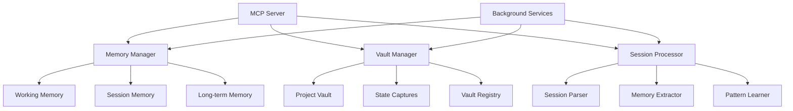
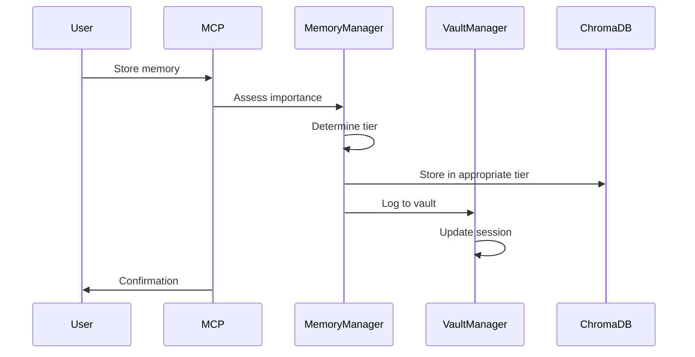

# Hierarchical Memory System Implementation Plan

## Project Overview

This document outlines the comprehensive plan to transform the MCP ChromaDB Memory Server from a simple memory storage system into a **Cognitive State Management Platform** with hierarchical memory organization, project-integrated Obsidian vault, and stateful capture capabilities.

## Vision Statement

Create an intelligent memory system that:
- Preserves development context across time, devices, and teams
- Learns from development sessions to improve future work
- Scales efficiently through hierarchical organization
- Integrates seamlessly with existing development workflows

This implementation follows the [[Platform Approach - Cognitive State Management]], transforming the MCP server from a tool into a comprehensive platform for cognitive state management.

## Implementation Phases

### Phase 1: Foundation (Week 1)

#### 1.1 Vault Infrastructure Setup
**Timeline**: 2 days

**Tasks**:
1. Create vault structure in `Project_Context/vault/`
2. Initialize Obsidian configuration
3. Set up vault templates
4. Create initial documentation

**Deliverables**:
- [ ] Vault folder structure created
- [ ] Template files for sessions, decisions, patterns
- [ ] Index.md with navigation
- [ ] Initial .obsidian configuration

#### 1.2 Vault Manager Implementation
**Timeline**: 2 days

**Files to create**:
- `src/vault-manager.ts` - Core vault management
- `src/config/vault-config.ts` - Vault configuration
- `src/types/vault.types.ts` - TypeScript interfaces

**Key features**:
```typescript
class VaultManager {
  // Vault operations
  setVaultPath(path: string): Promise<void>
  switchVault(vaultId: string): Promise<void>
  listVaults(): Promise<VaultInfo[]>
  
  // Backup/restore
  backupVault(): Promise<string>
  restoreVault(backupId: string): Promise<void>
  
  // Registration
  registerVault(name: string, path: string): Promise<void>
  getActiveVault(): Promise<VaultInfo>
}
```

#### 1.3 Three-Tier Memory System
**Timeline**: 3 days

**Updates to `memory-manager.ts`**:
1. Create three collections on initialization
2. Implement tier determination logic
3. Add migration capabilities
4. Update query logic for multi-tier search

**Tier specifications**:
```typescript
const TIER_CONFIG = {
  working: {
    retention: 48 * 60 * 60 * 1000, // 48 hours
    maxSize: 10000,
    importanceThreshold: 0.5
  },
  session: {
    retention: 14 * 24 * 60 * 60 * 1000, // 14 days
    maxSize: 50000,
    importanceThreshold: 0.7
  },
  longTerm: {
    retention: Infinity,
    maxSize: 100000,
    importanceThreshold: 0.85
  }
};
```

### Phase 2: Integration (Week 1-2)

#### 2.1 Session Processor
**Timeline**: 3 days

**New module**: `src/session-processor.ts`

**Features**:
- Parse Obsidian session markdown files
- Extract decisions, code snippets, achievements
- Convert to memories with appropriate metadata
- Handle file watching for new sessions

**Integration points**:
```typescript
class SessionProcessor {
  constructor(
    private obsidianManager: ObsidianManager,
    private memoryManager: MemoryManager
  ) {}
  
  async processSessionFile(filePath: string): Promise<ProcessedSession>
  async extractMemories(session: ParsedSession): Promise<Memory[]>
  async watchForNewSessions(): Promise<void>
}
```

#### 2.2 MCP Tool Extensions
**Timeline**: 2 days

**New tools to add**:
1. `set_vault_path` - Change active vault
2. `switch_vault` - Switch between registered vaults
3. `list_vaults` - Show available vaults
4. `backup_vault` - Create vault backup
5. `restore_vault` - Restore from backup
6. `capture_state` - Save current context
7. `restore_state` - Load saved context

#### 2.3 Git Integration
**Timeline**: 2 days

**Features**:
- Link memories to git commits
- Add branch context to memories
- Create commit hooks for auto-capture
- Enable PR-based memory queries

### Phase 3: Intelligence Layer (Week 2)

#### 3.1 Memory Consolidation Service
**Timeline**: 2 days

**New module**: `src/services/consolidation-service.ts`

**Algorithm**:
1. Find memories with >85% similarity
2. Merge metadata and update importance
3. Preserve access history
4. Remove redundant entries

#### 3.2 Pattern Recognition
**Timeline**: 3 days

**New module**: `src/services/pattern-learner.ts`

**Capabilities**:
- Identify frequently used tool combinations
- Recognize common problem-solution pairs
- Track decision evolution
- Build project-specific patterns

#### 3.3 Advanced Query Optimization
**Timeline**: 2 days

**Enhancements**:
- Time-context aware tier selection
- Parallel tier querying
- Result merging and deduplication
- Weighted scoring across tiers

### Phase 4: Automation (Week 2-3)

#### 4.1 Background Services
**Timeline**: 2 days

**Services to implement**:
- Memory migration scheduler
- Consolidation runner
- Vault synchronization
- Metrics collector

**Configuration**:
```typescript
const BACKGROUND_JOBS = {
  migration: {
    interval: 60 * 60 * 1000, // 1 hour
    enabled: true
  },
  consolidation: {
    interval: 24 * 60 * 60 * 1000, // 24 hours
    enabled: true
  },
  metrics: {
    interval: 5 * 60 * 1000, // 5 minutes
    enabled: true
  }
};
```

#### 4.2 Stateful Capture System
**Timeline**: 3 days

**New module**: `src/state-manager.ts`

**State capture includes**:
- Active memories in working tier
- Current context and focus
- Open questions and hypotheses
- Pending decisions
- Session metadata

### Phase 5: Polish & Deploy (Week 3)

#### 5.1 Testing Suite
**Timeline**: 2 days

**Test coverage**:
- Unit tests for all new modules
- Integration tests for tier migration
- Performance benchmarks
- Data integrity verification

#### 5.2 Documentation
**Timeline**: 2 days

**Documentation updates**:
- README.md with new features
- ARCHITECTURE.md with system design
- API.md with all endpoints
- MIGRATION.md for existing users

#### 5.3 Docker & Deployment
**Timeline**: 1 day

**Updates needed**:
- Docker image optimization
- Volume configuration for vault
- Environment variable updates
- CI/CD pipeline modifications

## Technical Architecture

### System Components



### Data Flow



## Resource Requirements

### Development Resources
- **Time**: 3 weeks (1 developer)
- **Dependencies**: ChromaDB, OpenAI API, Obsidian markdown parser
- **Testing**: Additional 1 week for comprehensive testing

### Runtime Resources
- **Memory**: 1.2-1.5GB typical, 2GB max
- **Storage**: 5-6GB with vault and backups
- **CPU**: 2-5% average, 30% during consolidation
- **Network**: 2-3x OpenAI API calls

## Risk Mitigation

### Technical Risks
1. **Performance degradation**
   - Mitigation: Tier-based optimization, caching
   
2. **Data loss**
   - Mitigation: Automated backups, version control
   
3. **Complexity**
   - Mitigation: Feature flags, gradual rollout

### Operational Risks
1. **API costs**
   - Mitigation: Configurable extraction, batch processing
   
2. **Storage growth**
   - Mitigation: Retention policies, compression

## Success Metrics

### Performance
- [ ] Query response <50ms for 95% of requests
- [ ] Memory consolidation reduces storage by >30%
- [ ] Session processing completes in <2s

### Functionality
- [ ] 100% of sessions successfully processed
- [ ] Zero data loss during migrations
- [ ] Vault switching in <100ms

### User Experience
- [ ] State restoration accuracy >95%
- [ ] Pattern recognition improves suggestions
- [ ] Documentation auto-generated from sessions

## Configuration Schema

```yaml
# Core Configuration
OBSIDIAN_VAULT_PATH: ./Project_Context/vault
AUTO_START_SESSION_LOGGING: true
ENABLE_HIERARCHICAL_MEMORY: true

# Tier Configuration
WORKING_MEMORY_RETENTION_HOURS: 48
SESSION_MEMORY_RETENTION_DAYS: 14
MEMORY_MIGRATION_INTERVAL_MINUTES: 60

# Consolidation
CONSOLIDATION_ENABLED: true
CONSOLIDATION_THRESHOLD: 0.85
CONSOLIDATION_SCHEDULE: "0 2 * * *"

# State Management
STATE_CAPTURE_ENABLED: true
STATE_CAPTURE_INTERVAL_MINUTES: 5
MAX_STATES_PER_VAULT: 100

# Background Services
BACKGROUND_PROCESSING_ENABLED: true
METRICS_COLLECTION_ENABLED: true
```

## Next Steps

1. **Immediate**: Create vault structure and templates
2. **Week 1**: Implement core vault manager and three-tier system
3. **Week 2**: Add intelligence features and automation
4. **Week 3**: Testing, documentation, and deployment

## Conclusion

This implementation plan transforms the MCP ChromaDB Memory Server into a comprehensive cognitive platform that will fundamentally improve how developers maintain context and learn from their work. The phased approach ensures each component is properly tested before moving to the next, minimizing risk while maximizing value delivery.

---
*Last Updated: 2025-01-05*
*Version: 1.0*