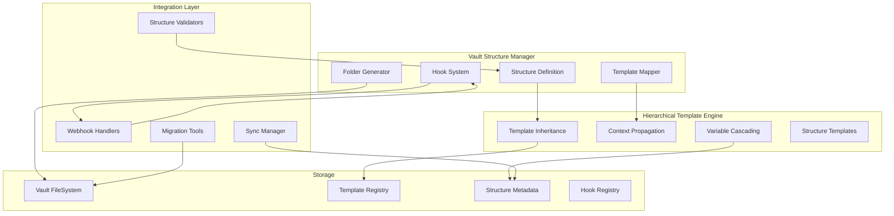

# Hierarchical Vault Structure System

## Overview

This document outlines the integration of a Universal Developer Documentation System into our templating platform, providing a standardized hierarchical folder structure with automated template management, inheritance, and webhook-based synchronization.

## Architecture

### Core Components



## Implementation Design

### 1. Vault Structure Manager (`src/vault-structure-manager.ts`)

```typescript
export interface VaultStructure {
  version: string;
  name: string;
  description: string;
  folders: FolderDefinition[];
  templates: TemplateMapping[];
  hooks: StructureHook[];
  metadata: StructureMetadata;
}

export interface FolderDefinition {
  path: string;
  name: string;
  prefix?: string;
  description: string;
  templates?: string[];
  children?: FolderDefinition[];
  metadata?: {
    icon?: string;
    color?: string;
    defaultTags?: string[];
    accessLevel?: 'public' | 'team' | 'private';
  };
}

export interface TemplateMapping {
  folderPath: string;
  templateId: string;
  isDefault?: boolean;
  autoApply?: boolean;
  inheritFrom?: string;
  variables?: Record<string, any>;
}

export interface StructureHook {
  id: string;
  name: string;
  trigger: 'folder_created' | 'file_created' | 'file_moved' | 'structure_sync';
  folderPattern?: string;
  action: HookAction;
  config?: Record<string, any>;
}

export class VaultStructureManager {
  private structure: VaultStructure;
  private templateManager: TemplateManager;
  private hookRegistry: Map<string, StructureHook>;
  
  async initializeStructure(structureDefinition: VaultStructure): Promise<void> {
    // Validate structure
    await this.validateStructure(structureDefinition);
    
    // Create folder hierarchy
    await this.createFolderHierarchy(structureDefinition.folders);
    
    // Map templates to folders
    await this.mapTemplatesToFolders(structureDefinition.templates);
    
    // Register hooks
    await this.registerStructureHooks(structureDefinition.hooks);
    
    // Initialize watchers
    await this.initializeWatchers();
  }
  
  async generateStructure(
    targetPath: string, 
    options?: GenerationOptions
  ): Promise<GenerationReport> {
    const report: GenerationReport = {
      foldersCreated: 0,
      templatesApplied: 0,
      hooksRegistered: 0,
      errors: []
    };
    
    // Recursive folder creation with template application
    for (const folder of this.structure.folders) {
      await this.createFolderRecursive(
        path.join(targetPath, folder.path),
        folder,
        report
      );
    }
    
    return report;
  }
  
  async applyFolderTemplate(
    folderPath: string,
    context?: TemplateContext
  ): Promise<void> {
    // Find matching template mapping
    const mapping = this.findTemplateMapping(folderPath);
    
    if (mapping) {
      // Apply template with inheritance
      await this.applyTemplateWithInheritance(
        folderPath,
        mapping,
        context
      );
    }
  }
}
```

### 2. Hierarchical Template System Extensions

```typescript
export interface HierarchicalTemplate extends Template {
  extends?: string; // Parent template ID
  folderContext?: {
    requiredStructure?: string[];
    defaultFiles?: FileTemplate[];
    childTemplates?: Record<string, string>;
  };
  inheritance?: {
    variables?: 'merge' | 'override' | 'append';
    content?: 'prepend' | 'append' | 'replace';
    metadata?: 'merge' | 'override';
  };
}

export interface FileTemplate {
  filename: string;
  templateId?: string;
  content?: string;
  variables?: Record<string, any>;
  condition?: string; // Conditional expression
}

export class HierarchicalTemplateEngine {
  async resolveTemplate(
    templateId: string,
    context: TemplateContext
  ): Promise<ResolvedTemplate> {
    const template = await this.loadTemplate(templateId);
    
    // Resolve inheritance chain
    const inheritanceChain = await this.resolveInheritanceChain(template);
    
    // Merge templates according to inheritance rules
    const merged = await this.mergeTemplateChain(inheritanceChain, context);
    
    // Apply folder context
    if (merged.folderContext) {
      await this.applyFolderContext(merged.folderContext, context);
    }
    
    return merged;
  }
  
  async applyFolderContext(
    folderContext: FolderContext,
    context: TemplateContext
  ): Promise<void> {
    // Create required structure
    if (folderContext.requiredStructure) {
      await this.createRequiredStructure(
        context.targetPath,
        folderContext.requiredStructure
      );
    }
    
    // Generate default files
    if (folderContext.defaultFiles) {
      for (const fileTemplate of folderContext.defaultFiles) {
        if (this.evaluateCondition(fileTemplate.condition, context)) {
          await this.generateFile(fileTemplate, context);
        }
      }
    }
  }
}
```

### 3. Universal Developer Documentation Structure Definition

```typescript
export const UNIVERSAL_DEV_DOCS_STRUCTURE: VaultStructure = {
  version: "1.0.0",
  name: "Universal Developer Documentation System",
  description: "Comprehensive, language-agnostic documentation structure",
  folders: [
    {
      path: "00-System",
      name: "System",
      prefix: "00",
      description: "Core system files and templates",
      children: [
        {
          path: "01-Templates",
          name: "Templates",
          templates: ["system-templates-index"],
          metadata: { icon: "📄", defaultTags: ["#system/template"] }
        },
        {
          path: "02-Attachments",
          name: "Attachments",
          metadata: { icon: "📎" }
        },
        {
          path: "03-Archive",
          name: "Archive",
          metadata: { icon: "🗄️" }
        },
        {
          path: "04-Meta",
          name: "Meta",
          templates: ["meta-documentation"],
          metadata: { icon: "⚙️" }
        }
      ]
    },
    {
      path: "10-Active-Projects",
      name: "Active Projects",
      prefix: "10",
      templates: ["project-folder", "projects-dashboard"],
      metadata: { 
        icon: "🚀",
        defaultTags: ["#project/active"]
      }
    },
    {
      path: "20-Development-Stack",
      name: "Development Stack",
      prefix: "20",
      children: [
        {
          path: "21-Languages",
          name: "Languages",
          templates: ["language-reference"],
          metadata: { icon: "💻" }
        },
        {
          path: "22-Frameworks",
          name: "Frameworks",
          templates: ["framework-guide"],
          metadata: { icon: "🏗️" }
        },
        {
          path: "23-Libraries",
          name: "Libraries",
          templates: ["library-docs"],
          metadata: { icon: "📚" }
        },
        {
          path: "24-Tools",
          name: "Tools",
          templates: ["tool-configuration"],
          metadata: { icon: "🔧" }
        },
        {
          path: "25-Services",
          name: "Services",
          templates: ["service-integration"],
          metadata: { icon: "☁️" }
        }
      ]
    },
    // ... continue with all folders from the structure
  ],
  templates: [
    {
      folderPath: "10-Active-Projects/[project-name]",
      templateId: "project-template",
      isDefault: true,
      autoApply: true,
      variables: {
        folderName: "{{folder.name}}",
        createdDate: "{{_system.date}}",
        projectPath: "{{folder.path}}"
      }
    },
    {
      folderPath: "20-Development-Stack/21-Languages/[language-name]",
      templateId: "language-reference-template",
      inheritFrom: "technical-documentation-base",
      variables: {
        language: "{{folder.name}}",
        category: "language"
      }
    },
    // ... more template mappings
  ],
  hooks: [
    {
      id: "project-creation-hook",
      name: "Project Creation Hook",
      trigger: "folder_created",
      folderPattern: "10-Active-Projects/*",
      action: {
        type: "apply_template_set",
        templates: [
          "project-overview",
          "project-tasks",
          "project-documentation"
        ],
        createSubfolders: ["tasks", "documentation", "research", "meetings", "decisions"]
      }
    },
    {
      id: "daily-note-hook",
      name: "Daily Note Creation",
      trigger: "file_created",
      folderPattern: "70-Task-Management/71-Daily-Notes/*",
      action: {
        type: "apply_template",
        templateId: "daily-note-template",
        linkToActiveProjects: true
      }
    },
    {
      id: "snippet-indexing-hook",
      name: "Code Snippet Indexer",
      trigger: "file_created",
      folderPattern: "40-Code-Library/41-Snippets/**",
      action: {
        type: "index_snippet",
        addToSearchIndex: true,
        generateTags: true
      }
    }
  ],
  metadata: {
    author: "Platform Team",
    version: "1.0.0",
    lastUpdated: "2024-01-07",
    compatibility: {
      minVersion: "2.0.0",
      platforms: ["obsidian", "filesystem", "cloud"]
    }
  }
};
```

### 4. Structure Hooks System

```typescript
export interface StructureHookSystem {
  registerHook(hook: StructureHook): Promise<string>;
  executeHook(hookId: string, context: HookContext): Promise<HookResult>;
  watchFolder(pattern: string, callback: HookCallback): void;
}

export class VaultStructureHooks implements StructureHookSystem {
  private hooks: Map<string, StructureHook> = new Map();
  private watchers: Map<string, FSWatcher> = new Map();
  
  async registerHook(hook: StructureHook): Promise<string> {
    this.hooks.set(hook.id, hook);
    
    // Set up file system watcher if needed
    if (hook.folderPattern) {
      await this.setupWatcher(hook);
    }
    
    return hook.id;
  }
  
  async executeHook(hookId: string, context: HookContext): Promise<HookResult> {
    const hook = this.hooks.get(hookId);
    if (!hook) {
      throw new Error(`Hook ${hookId} not found`);
    }
    
    switch (hook.action.type) {
      case 'apply_template_set':
        return await this.applyTemplateSet(hook.action, context);
        
      case 'index_snippet':
        return await this.indexSnippet(hook.action, context);
        
      case 'link_to_hub':
        return await this.createHubLinks(hook.action, context);
        
      case 'generate_moc':
        return await this.generateMapOfContents(hook.action, context);
        
      default:
        throw new Error(`Unknown hook action: ${hook.action.type}`);
    }
  }
  
  private async applyTemplateSet(
    action: ApplyTemplateSetAction,
    context: HookContext
  ): Promise<HookResult> {
    const results = [];
    
    // Create subfolders
    if (action.createSubfolders) {
      for (const subfolder of action.createSubfolders) {
        await this.createSubfolder(context.targetPath, subfolder);
      }
    }
    
    // Apply templates
    for (const templateId of action.templates) {
      const result = await this.templateManager.applyTemplate(
        templateId,
        {
          ...context.variables,
          parentFolder: context.targetPath
        }
      );
      results.push(result);
    }
    
    return { success: true, results };
  }
}
```

### 5. Integration with Existing Template System

```typescript
// Extension to template-manager.ts
export class EnhancedTemplateManager extends TemplateManager {
  private structureManager: VaultStructureManager;
  private hierarchicalEngine: HierarchicalTemplateEngine;
  
  async importStructure(source: StructureSource): Promise<VaultStructure> {
    // Import complete structure definition
    const structure = await this.fetchStructureDefinition(source);
    
    // Import all associated templates
    for (const template of structure.templates) {
      await this.importTemplate({
        type: 'webhook',
        url: `${source.baseUrl}/templates/${template.templateId}`
      });
    }
    
    // Initialize structure
    await this.structureManager.initializeStructure(structure);
    
    return structure;
  }
  
  async applyStructureTemplate(
    structureId: string,
    targetPath: string,
    options?: StructureOptions
  ): Promise<GenerationReport> {
    const structure = await this.getStructure(structureId);
    
    // Generate complete folder hierarchy
    const report = await this.structureManager.generateStructure(
      targetPath,
      {
        ...options,
        applyTemplates: true,
        registerHooks: true
      }
    );
    
    // Apply post-generation hooks
    await this.executePostGenerationHooks(structure, targetPath);
    
    return report;
  }
}
```

### 6. MCP Tools for Structure Management

```typescript
// New MCP tools to add
server.tool(
  'import_vault_structure',
  'Import a complete vault structure with templates and hooks',
  {
    source: z.string().url(),
    applyImmediately: z.boolean().optional(),
    targetPath: z.string().optional()
  },
  async (args) => {
    const structure = await templateManager.importStructure({
      type: 'webhook',
      baseUrl: args.source
    });
    
    if (args.applyImmediately) {
      const report = await templateManager.applyStructureTemplate(
        structure.name,
        args.targetPath || vaultManager.getActiveVault().path
      );
      return { structure, report };
    }
    
    return { structure, message: 'Structure imported successfully' };
  }
);

server.tool(
  'generate_vault_structure',
  'Generate folder hierarchy from a structure template',
  {
    structureId: z.string(),
    targetPath: z.string(),
    options: z.object({
      skipExisting: z.boolean().optional(),
      dryRun: z.boolean().optional()
    }).optional()
  },
  async (args) => {
    const report = await structureManager.generateStructure(
      args.targetPath,
      args.options
    );
    
    return {
      success: true,
      report,
      message: `Generated ${report.foldersCreated} folders with ${report.templatesApplied} templates`
    };
  }
);

server.tool(
  'apply_folder_hooks',
  'Apply hooks to existing folder structure',
  {
    folderPath: z.string(),
    hookIds: z.array(z.string()).optional()
  },
  async (args) => {
    const results = await structureManager.applyFolderHooks(
      args.folderPath,
      args.hookIds
    );
    
    return {
      success: true,
      hooksApplied: results.length,
      results
    };
  }
);
```

## Benefits

1. **Standardization**: Provides a universal structure that works across all technologies
2. **Automation**: Hooks automatically apply templates and organize content
3. **Scalability**: Numbered prefix system allows organic growth
4. **Inheritance**: Templates can inherit from base templates for consistency
5. **Integration**: Seamlessly integrates with existing template system
6. **Flexibility**: Can be customized per project while maintaining standards

## Implementation Phases

### Phase 1: Core Structure System
- Implement VaultStructureManager
- Create structure definition format
- Build folder generation engine

### Phase 2: Template Integration
- Extend template system with hierarchy support
- Implement template inheritance
- Add folder-context templates

### Phase 3: Hook System
- Create hook registry and executor
- Implement file system watchers
- Build standard hook actions

### Phase 4: Import/Export
- Create structure import from webhooks
- Build structure export functionality
- Add migration tools

### Phase 5: Advanced Features
- Implement smart indexing
- Add cross-reference generation
- Create structure analytics

## Configuration

```yaml
# Structure configuration in .env
VAULT_STRUCTURE_VERSION=1.0.0
VAULT_STRUCTURE_AUTO_APPLY=true
VAULT_STRUCTURE_HOOKS_ENABLED=true
VAULT_STRUCTURE_WATCH_FOLDERS=true
VAULT_STRUCTURE_INDEX_ON_CREATE=true

# Hook configuration
HOOK_EXECUTION_TIMEOUT=30000
HOOK_MAX_RETRIES=3
HOOK_ASYNC_EXECUTION=true

# Structure sources
STRUCTURE_ALLOWED_SOURCES=github.com,structures.company.com
STRUCTURE_SYNC_INTERVAL=86400
```

This hierarchical vault structure system transforms the template system into a complete documentation framework that automatically organizes, templates, and maintains developer documentation across any technology stack.