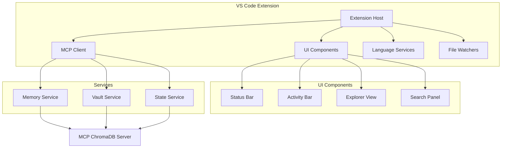

# VS Code Extension Roadmap - Cognitive State Management

## Overview

This roadmap outlines the development of a VS Code extension that serves as a powerful front-end for the MCP ChromaDB Memory Server, transforming VS Code into a cognitive development environment that remembers and learns from your development history.

## Vision

Create the first IDE extension that provides:
- **Persistent cognitive state** across development sessions
- **Intelligent memory-based code suggestions**
- **Visual development history and state management**
- **Team knowledge integration** within the IDE

## Architecture Overview



## Development Phases

### Phase 1: Foundation (Weeks 1-2)

#### Objectives
- Establish core extension architecture
- Implement MCP client connection
- Create basic command palette integration
- Set up development environment

#### Deliverables

##### Week 1: Extension Scaffold
- [ ] Initialize VS Code extension project
- [ ] Set up TypeScript configuration
- [ ] Configure bundling (webpack/esbuild)
- [ ] Implement basic activation events
- [ ] Create extension configuration schema

##### Week 2: MCP Integration
- [ ] Implement MCP client wrapper
- [ ] Create connection manager with retry logic
- [ ] Add status bar with connection indicator
- [ ] Implement basic command palette commands:
  - `Cognitive: Connect to Server`
  - `Cognitive: Health Check`
  - `Cognitive: Store Memory`
  - `Cognitive: Search Memories`

#### Technical Specifications
```typescript
// Extension architecture
interface CognitiveExtension {
  // Core services
  mcpClient: MCPClient;
  connectionManager: ConnectionManager;
  configManager: ConfigurationManager;
  
  // Commands
  commands: Map<string, Command>;
  
  // UI elements
  statusBar: StatusBarManager;
}

// MCP client wrapper
class MCPClient {
  constructor(private config: MCPConfig) {}
  
  async connect(): Promise<void>;
  async call(tool: string, args: any): Promise<any>;
  async disconnect(): Promise<void>;
}
```

### Phase 2: Visual Interface (Weeks 3-4)

#### Objectives
- Create comprehensive UI for memory exploration
- Implement vault management interface
- Add state timeline visualization
- Design intuitive user interactions

#### Deliverables

##### Week 3: Activity Bar & Explorer
- [ ] Add custom Activity Bar icon
- [ ] Create Memory Explorer tree view
  - Recent memories
  - Categorized memories
  - Search functionality
- [ ] Implement Vault Manager view
  - List vaults
  - Switch active vault
  - Create/delete vaults
- [ ] Add refresh and filter capabilities

##### Week 4: State Management UI
- [ ] Create State Timeline view
  - Visual timeline of captures
  - State preview on hover
  - Quick restore actions
- [ ] Implement State Diff viewer
- [ ] Add memory search webview panel
- [ ] Create settings UI for extension config

#### UI Mockups

##### Memory Explorer
```
🧠 COGNITIVE MEMORY
├── 📊 Statistics
│   └── Total: 1,247 memories
├── 🕐 Recent Memories
│   ├── Fixed auth bug (2h ago)
│   ├── Updated user service (1d ago)
│   └── Refactored database (3d ago)
├── 🏷️ Categories
│   ├── task_critical (45)
│   ├── code_snippet (234)
│   └── user_preference (23)
└── 🔍 Search...
```

##### State Timeline
```
📅 STATE TIMELINE
┌─────────────────────────────┐
│ ← November 2024 →           │
├─────────────────────────────┤
│ 28 │ ● ● ○ ● ● ● ○ ○      │
│ 27 │ ● ○ ● ● ○ ○ ○ ○      │
│ 26 │ ● ● ● ○ ○ ○ ○ ○      │
└─────────────────────────────┘
● = State captured
○ = No state

Selected: "Pre-deployment state"
Files: 47 | Memories: 1,232
[Preview] [Restore] [Compare]
```

### Phase 3: Editor Integration (Weeks 5-6)

#### Objectives
- Enhance code editor with memory-powered features
- Implement intelligent suggestions
- Add visual indicators for memory associations
- Create seamless editing experience

#### Deliverables

##### Week 5: Editor Enhancements
- [ ] Implement CodeLens provider
  - Show memory count above functions/classes
  - Display last modification info
  - Quick access to related memories
- [ ] Create Hover provider
  - Show related memories on hover
  - Display past implementations
  - Show team knowledge
- [ ] Add Decoration provider
  - Highlight code with memories
  - Visual indicators for patterns

##### Week 6: Intelligent Features
- [ ] Implement Completion provider
  - Suggest from memory patterns
  - Context-aware completions
  - Learn from acceptance/rejection
- [ ] Create Code Action provider
  - "Store as memory" action
  - "Find similar" action
  - "Apply pattern" action
- [ ] Add Diagnostic provider
  - Detect inconsistencies
  - Suggest improvements
  - Warn about deprecated patterns

#### Code Examples

```typescript
// CodeLens example
class UserService {
  // 📊 12 memories | Last modified: 2 days ago | View history
  async createUser(data: UserData) {
    // Implementation
  }
}

// Inline suggestion example
function calculateTotal(items) {
  // 💡 Similar implementation found in 3 memories
  // → items.reduce((sum, item) => sum + item.price, 0)
  
}
```

### Phase 4: Intelligence Features (Weeks 7-8)

#### Objectives
- Implement automatic state capture
- Create pattern recognition system
- Integrate with AI assistants
- Enable team collaboration

#### Deliverables

##### Week 7: Automation & Patterns
- [ ] Implement auto-capture system
  - On git operations
  - During debug sessions
  - Task completion detection
  - Configurable triggers
- [ ] Create pattern detection
  - Code pattern analysis
  - Workflow pattern recognition
  - Anomaly detection
- [ ] Add smart notifications
  - Suggest relevant memories
  - Warn about conflicts
  - Recommend best practices

##### Week 8: AI & Collaboration
- [ ] Integrate with AI assistants
  - Feed context to Copilot
  - Enhance Codeium suggestions
  - Custom AI prompts with memory
- [ ] Implement team features
  - Shared vault access
  - Team pattern library
  - Knowledge attribution
- [ ] Add analytics dashboard
  - Memory usage stats
  - Pattern effectiveness
  - Team insights

#### Intelligence Features

```typescript
// Auto-capture configuration
{
  "cognitive.autoCapture": {
    "onCommit": true,
    "onDebugStart": true,
    "onTaskComplete": true,
    "interval": "hourly",
    "filters": {
      "minChanges": 10,
      "excludePaths": ["node_modules", "dist"]
    }
  }
}

// Pattern detection example
interface DetectedPattern {
  type: "code" | "workflow" | "architecture";
  pattern: string;
  confidence: number;
  occurrences: Location[];
  suggestion: string;
}
```

## Technical Implementation

### Extension Structure
```
vscode-cognitive-memory/
├── src/
│   ├── extension.ts          # Entry point
│   ├── client/
│   │   ├── mcpClient.ts      # MCP client wrapper
│   │   └── connection.ts     # Connection management
│   ├── providers/
│   │   ├── codeLens.ts       # CodeLens provider
│   │   ├── completion.ts     # Completion provider
│   │   ├── hover.ts          # Hover provider
│   │   └── treeData.ts       # Tree data providers
│   ├── views/
│   │   ├── memoryExplorer.ts # Memory explorer
│   │   ├── stateTimeline.ts  # State timeline
│   │   └── searchPanel.ts    # Search interface
│   ├── services/
│   │   ├── autoCapture.ts    # Auto-capture logic
│   │   ├── patternMatcher.ts # Pattern detection
│   │   └── analytics.ts      # Usage analytics
│   └── utils/
│       ├── config.ts         # Configuration
│       └── logger.ts         # Logging utilities
├── resources/
│   ├── icons/                # Extension icons
│   └── webview/              # Webview assets
├── package.json              # Extension manifest
└── README.md                 # Documentation
```

### Key APIs and Integration Points

#### VS Code APIs
- `vscode.languages.*` - Language features
- `vscode.window.*` - UI components
- `vscode.workspace.*` - Workspace management
- `vscode.commands.*` - Command registration
- `vscode.ExtensionContext` - Extension lifecycle

#### MCP Integration
```typescript
// Tool calls to MCP server
await mcpClient.call('store_memory', {
  content: selectedText,
  context: 'code_snippet',
  metadata: {
    file: document.fileName,
    line: selection.start.line,
    language: document.languageId
  }
});

await mcpClient.call('search_hybrid', {
  query: searchTerm,
  exactWeight: 0.4,
  limit: 20
});
```

## Testing Strategy

### Unit Tests
- Test individual providers
- Mock VS Code APIs
- Test MCP client wrapper
- Validate UI components

### Integration Tests
- Test end-to-end workflows
- Verify MCP communication
- Test state persistence
- Validate error handling

### User Acceptance Tests
- Memory storage and retrieval
- State capture and restore
- Search functionality
- Performance benchmarks

## Release Plan

### Alpha Release (End of Phase 2)
- Basic functionality
- Internal testing
- Core features only
- Limited to early adopters

### Beta Release (End of Phase 3)
- Full UI implementation
- Editor integration
- Public preview
- Community feedback

### Release Candidate (End of Phase 4)
- All features complete
- Performance optimized
- Documentation complete
- Ready for production

### v1.0 Release
- Stable release
- VS Code Marketplace
- Full documentation
- Video tutorials

## Success Metrics

### Adoption Metrics
- Extension installs
- Daily active users
- Memory operations/day
- State captures/user

### Performance Metrics
- Connection latency < 100ms
- Search response < 500ms
- Memory storage < 200ms
- UI responsiveness < 50ms

### Quality Metrics
- Crash rate < 0.1%
- Error rate < 1%
- User satisfaction > 4.5/5
- Support tickets < 5/week

## Risk Mitigation

### Technical Risks
- **MCP connection issues**: Implement robust retry logic
- **Performance degradation**: Use pagination and caching
- **Memory leaks**: Regular profiling and cleanup
- **API changes**: Version compatibility checks

### User Experience Risks
- **Complex UI**: User testing and iteration
- **Feature overload**: Progressive disclosure
- **Learning curve**: Interactive tutorials
- **Data privacy**: Clear data handling policies

## Future Enhancements

### v2.0 Features
- Multi-root workspace support
- Remote development integration
- Advanced AI integration
- Custom memory providers

### Long-term Vision
- IDE-agnostic framework
- Cloud synchronization
- Enterprise features
- Mobile companion app

## Resources

### Documentation
- [VS Code Extension API](https://code.visualstudio.com/api)
- [MCP Protocol Spec](https://modelcontextprotocol.io)
- [Extension Guidelines](https://code.visualstudio.com/api/references/extension-guidelines)

### Tools
- [VS Code Extension Generator](https://github.com/Microsoft/vscode-generator-code)
- [Extension Testing Framework](https://code.visualstudio.com/api/working-with-extensions/testing-extension)
- [Webview UI Toolkit](https://github.com/microsoft/vscode-webview-ui-toolkit)

---

*This roadmap is a living document and will be updated as development progresses.*