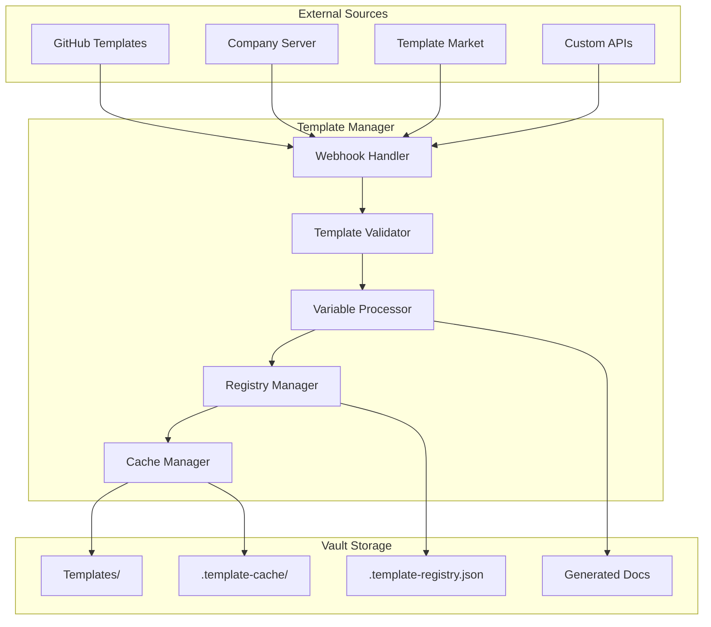

# Template System Design - Webhook Import Feature

## Overview

The Template System enables dynamic documentation template management with third-party webhook integration, allowing teams to maintain centralized template libraries and import them on-demand.

## Architecture



## Core Components

### 1. Template Manager (`src/template-manager.ts`)

```typescript
export class TemplateManager {
  private registry: TemplateRegistry;
  private validator: TemplateValidator;
  private webhookHandler: WebhookHandler;
  private cache: TemplateCache;
  
  constructor(
    private vaultManager: VaultManager,
    private config: TemplateConfig
  ) {
    this.registry = new TemplateRegistry(vaultManager);
    this.validator = new TemplateValidator();
    this.webhookHandler = new WebhookHandler(config.webhooks);
    this.cache = new TemplateCache(config.cacheDir);
  }
  
  // Core operations
  async importTemplate(source: TemplateSource): Promise<Template>
  async applyTemplate(templateId: string, variables: Variables): Promise<string>
  async syncTemplates(): Promise<SyncReport>
  async validateTemplate(content: string): Promise<ValidationResult>
  
  // Registry operations
  async listTemplates(filter?: TemplateFilter): Promise<Template[]>
  async getTemplate(id: string): Promise<Template>
  async deleteTemplate(id: string): Promise<void>
  
  // Webhook operations
  async registerWebhook(config: WebhookConfig): Promise<string>
  async handleWebhook(payload: WebhookPayload): Promise<void>
  async testWebhook(webhookId: string): Promise<TestResult>
}
```

### 2. Template Types

```typescript
interface Template {
  id: string;
  name: string;
  description: string;
  version: string;
  category: TemplateCategory;
  source: TemplateSource;
  content: string;
  variables: TemplateVariable[];
  metadata: TemplateMetadata;
  checksum: string;
}

interface TemplateVariable {
  name: string;
  description: string;
  type: 'string' | 'number' | 'boolean' | 'date' | 'array' | 'object';
  required: boolean;
  default?: any;
  validation?: ValidationRule;
  options?: any[]; // For enum-like variables
}

interface TemplateSource {
  type: 'webhook' | 'file' | 'git' | 'api';
  url: string;
  auth?: AuthConfig;
  syncEnabled?: boolean;
  syncInterval?: number; // minutes
}

interface WebhookPayload {
  event: 'template.created' | 'template.updated' | 'template.deleted';
  template: Template;
  timestamp: Date;
  signature?: string; // For webhook verification
}
```

### 3. Webhook Handler (`src/services/webhook-handler.ts`)

```typescript
export class WebhookHandler {
  private webhooks: Map<string, WebhookConfig>;
  private httpClient: HttpClient;
  
  async registerWebhook(config: WebhookConfig): Promise<string> {
    // Validate webhook URL
    await this.validateWebhook(config.url);
    
    // Store webhook configuration
    const id = generateWebhookId();
    this.webhooks.set(id, config);
    
    // Register with external service if needed
    if (config.registrationEndpoint) {
      await this.registerWithService(config);
    }
    
    return id;
  }
  
  async fetchTemplate(webhookId: string, templateId?: string): Promise<Template[]> {
    const config = this.webhooks.get(webhookId);
    if (!config) throw new Error('Webhook not found');
    
    const response = await this.httpClient.get(config.url, {
      headers: this.buildHeaders(config),
      params: templateId ? { id: templateId } : {}
    });
    
    return this.parseTemplateResponse(response);
  }
  
  async handleIncomingWebhook(
    webhookId: string, 
    payload: any, 
    headers: Record<string, string>
  ): Promise<void> {
    // Verify webhook signature if configured
    if (!this.verifySignature(webhookId, payload, headers)) {
      throw new Error('Invalid webhook signature');
    }
    
    // Process webhook payload
    const event = this.parseWebhookEvent(payload);
    await this.processWebhookEvent(event);
  }
}
```

### 4. Template Validator

```typescript
export class TemplateValidator {
  private schema: ValidationSchema;
  
  async validateTemplate(content: string): Promise<ValidationResult> {
    const validation = {
      valid: true,
      errors: [] as ValidationError[],
      warnings: [] as ValidationWarning[]
    };
    
    try {
      // Parse frontmatter
      const { data, content: body } = matter(content);
      
      // Validate structure
      this.validateStructure(data, validation);
      
      // Validate variables
      this.validateVariables(data.variables, validation);
      
      // Validate content
      this.validateContent(body, data.variables, validation);
      
      // Security checks
      this.performSecurityChecks(content, validation);
      
    } catch (error) {
      validation.valid = false;
      validation.errors.push({
        type: 'parse_error',
        message: error.message
      });
    }
    
    return validation;
  }
  
  private performSecurityChecks(content: string, validation: ValidationResult): void {
    // Check for script injection
    if (/<script|<iframe|javascript:/i.test(content)) {
      validation.valid = false;
      validation.errors.push({
        type: 'security',
        message: 'Template contains potentially unsafe content'
      });
    }
    
    // Check for suspicious patterns
    const suspiciousPatterns = [
      /eval\s*\(/,
      /new\s+Function/,
      /__proto__/,
      /constructor\s*\[/
    ];
    
    for (const pattern of suspiciousPatterns) {
      if (pattern.test(content)) {
        validation.warnings.push({
          type: 'security',
          message: `Template contains suspicious pattern: ${pattern}`
        });
      }
    }
  }
}
```

### 5. Template Application

```typescript
export class TemplateProcessor {
  private handlebars: typeof Handlebars;
  
  constructor() {
    this.handlebars = Handlebars.create();
    this.registerHelpers();
  }
  
  async applyTemplate(
    template: Template, 
    variables: Record<string, any>
  ): Promise<string> {
    // Validate required variables
    this.validateRequiredVariables(template, variables);
    
    // Apply defaults
    const finalVariables = this.applyDefaults(template, variables);
    
    // Add system variables
    const enrichedVariables = {
      ...finalVariables,
      _system: {
        date: new Date().toISOString(),
        timestamp: Date.now(),
        vault: this.vaultManager.getActiveVault().name,
        user: process.env.USER
      }
    };
    
    // Compile and render template
    const compiled = this.handlebars.compile(template.content);
    return compiled(enrichedVariables);
  }
  
  private registerHelpers(): void {
    // Date formatting
    this.handlebars.registerHelper('formatDate', (date, format) => {
      return moment(date).format(format);
    });
    
    // Conditional helpers
    this.handlebars.registerHelper('when', (condition, options) => {
      if (condition) {
        return options.fn(this);
      }
      return options.inverse(this);
    });
    
    // Array/List helpers
    this.handlebars.registerHelper('join', (array, separator) => {
      return array.join(separator || ', ');
    });
    
    // String helpers
    this.handlebars.registerHelper('capitalize', (str) => {
      return str.charAt(0).toUpperCase() + str.slice(1);
    });
    
    // Code formatting
    this.handlebars.registerHelper('code', (language, content) => {
      return `\`\`\`${language}\n${content}\n\`\`\``;
    });
  }
}
```

## MCP Tools

### New Template Management Tools

```typescript
// Import template from webhook
server.tool(
  'import_template',
  'Import a documentation template from external source',
  {
    source: z.string().url(),
    category: z.enum(['session', 'decision', 'pattern', 'solution', 'snippet', 'custom']),
    variables: z.record(z.any()).optional(),
    saveAs: z.string().optional()
  },
  async (args) => {
    const template = await templateManager.importTemplate({
      type: 'webhook',
      url: args.source
    });
    
    if (args.variables) {
      const content = await templateManager.applyTemplate(template.id, args.variables);
      const filename = args.saveAs || `${template.name}-${Date.now()}.md`;
      await vaultManager.saveDocument(filename, content);
      return { template, documentPath: filename };
    }
    
    return { template, message: 'Template imported successfully' };
  }
);

// List available templates
server.tool(
  'list_templates',
  'List all available templates',
  {
    category: z.string().optional(),
    source: z.string().optional()
  },
  async (args) => {
    const templates = await templateManager.listTemplates({
      category: args.category,
      source: args.source
    });
    return { templates, count: templates.length };
  }
);

// Apply template with variables
server.tool(
  'apply_template',
  'Apply a template with given variables',
  {
    templateId: z.string(),
    variables: z.record(z.any()),
    outputPath: z.string()
  },
  async (args) => {
    const content = await templateManager.applyTemplate(
      args.templateId,
      args.variables
    );
    await vaultManager.saveDocument(args.outputPath, content);
    return { 
      success: true, 
      path: args.outputPath,
      preview: content.substring(0, 200) + '...'
    };
  }
);

// Configure webhook source
server.tool(
  'configure_template_webhook',
  'Configure a webhook source for templates',
  {
    name: z.string(),
    url: z.string().url(),
    authType: z.enum(['none', 'bearer', 'api-key', 'oauth']).optional(),
    authCredentials: z.string().optional(),
    syncInterval: z.number().optional()
  },
  async (args) => {
    const webhookId = await templateManager.registerWebhook({
      name: args.name,
      url: args.url,
      authType: args.authType || 'none',
      authCredentials: args.authCredentials,
      syncInterval: args.syncInterval
    });
    return { webhookId, message: 'Webhook configured successfully' };
  }
);

// Sync templates from all sources
server.tool(
  'sync_templates',
  'Synchronize templates from all configured sources',
  {},
  async () => {
    const report = await templateManager.syncTemplates();
    return {
      synced: report.synced,
      updated: report.updated,
      failed: report.failed,
      sources: report.sources
    };
  }
);
```

## Webhook Integration Examples

### 1. GitHub Templates

```typescript
// Configure GitHub as template source
await configureTemplateWebhook({
  name: 'GitHub Templates',
  url: 'https://api.github.com/repos/myorg/templates/contents',
  authType: 'bearer',
  authCredentials: process.env.GITHUB_TOKEN,
  syncInterval: 60 // hourly
});
```

### 2. Company Template Server

```typescript
// Configure company server
await configureTemplateWebhook({
  name: 'Company Templates',
  url: 'https://templates.company.com/api/v1/templates',
  authType: 'api-key',
  authCredentials: process.env.COMPANY_API_KEY,
  headers: {
    'X-Department': 'Engineering',
    'X-Team': 'Platform'
  }
});
```

### 3. Template Marketplace

```typescript
// Configure template marketplace
await configureTemplateWebhook({
  name: 'Template Market',
  url: 'https://templatemarket.io/api/templates',
  authType: 'oauth',
  authCredentials: oauthToken,
  filter: {
    category: 'development',
    rating: 4.5,
    license: 'MIT'
  }
});
```

## Security Considerations

### 1. Webhook Verification
- Signature validation (HMAC)
- IP allowlisting
- Rate limiting
- Replay attack prevention

### 2. Template Validation
- Content sanitization
- Variable injection prevention
- Script execution blocking
- Size limits

### 3. Access Control
- Read-only webhook access
- Approval workflow for auto-import
- Audit logging
- Role-based permissions

## Configuration

### Environment Variables

```bash
# Template System
TEMPLATE_CACHE_DIR=./vault/.template-cache
TEMPLATE_MAX_SIZE=1MB
TEMPLATE_SYNC_ENABLED=true
TEMPLATE_AUTO_IMPORT=false

# Webhook Configuration
WEBHOOK_TIMEOUT=30000
WEBHOOK_MAX_RETRIES=3
WEBHOOK_SIGNATURE_HEADER=X-Template-Signature
WEBHOOK_RATE_LIMIT=100

# Security
TEMPLATE_SECURITY_SCAN=true
TEMPLATE_SANDBOX_MODE=true
TEMPLATE_ALLOWED_SOURCES=github.com,company.com
```

## Benefits

1. **Standardization**: Consistent documentation across projects
2. **Automation**: Reduce manual documentation effort
3. **Centralization**: Single source of truth for templates
4. **Flexibility**: Easy to update and distribute templates
5. **Integration**: Works with existing tools and workflows

## Future Enhancements

1. **Template Versioning**: Track template evolution
2. **Template Dependencies**: Templates that include other templates
3. **AI Enhancement**: Use AI to suggest variable values
4. **Template Analytics**: Track template usage and effectiveness
5. **Visual Editor**: GUI for template creation and editing

---
*This feature enhances the platform's documentation capabilities and enables teams to maintain consistent, high-quality documentation.*