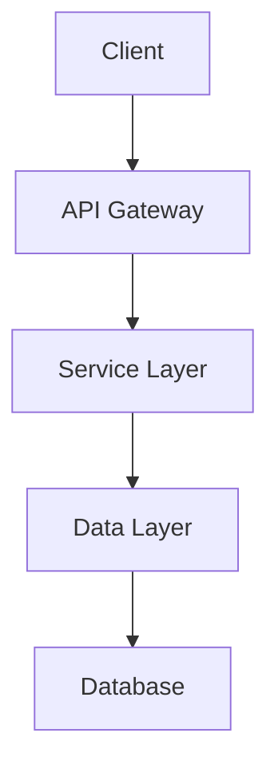

# {{projectName}}

**Created**: {{formatDate _system.date "YYYY-MM-DD"}}  
**Type**: {{projectType}}  
**Status**: 🟡 Planning  
{{#if deadline}}**Deadline**: {{formatDate deadline "MMMM DD, YYYY"}}{{/if}}

## Overview

Brief description of {{projectName}} purpose and goals.

## Objectives

- [ ] Define project scope and requirements
- [ ] Set up development environment
- [ ] Create initial project structure
- [ ] Implement core features
- [ ] Write comprehensive tests
- [ ] Deploy to production

## Technical Stack

- **Language**: {{primaryLanguage}}
{{#if framework}}- **Framework**: {{framework}}{{/if}}
- **Database**: _TBD_
- **Services**: _TBD_
- **Deployment**: _TBD_

## Architecture

_Update this diagram as architecture evolves_

## Team

{{#if team}}
{{#each team}}
- {{this.name}} - {{this.role}}
{{/each}}
{{else}}
- Project Lead: _TBD_
- Developers: _TBD_
- QA: _TBD_
{{/if}}

## Resources

{{#if repository}}- [Repository]({{repository}}){{/if}}
- [[{{projectName}}-specification|Project Specification]]
- [[{{projectName}}-requirements|Technical Requirements]]
- [[{{projectName}}-api|API Documentation]]

## Quick Links

### Documentation
- [[documentation/architecture|Architecture Overview]]
- [[documentation/setup-guide|Setup Guide]]
- [[documentation/deployment|Deployment Guide]]

### Development
- [[tasks/task-board|Task Board]]
- [[tasks/sprint-planning|Sprint Planning]]
- [[decisions/README|Decision Log]]

### Meetings
- [[meetings/kickoff|Kickoff Meeting]]
- [[meetings/daily-standups|Daily Standups]]
- [[meetings/retrospectives|Retrospectives]]

## Current Sprint

### Active Tasks
<!-- Automatically populated from task board -->
![[tasks/task-board#Active Tasks]]

### Blockers
<!-- List any current blockers -->
- None

## Key Decisions

<!-- Automatically populated from decisions folder -->
![[decisions/README#Recent Decisions]]

## Project Health

| Metric | Status | Notes |
|--------|--------|-------|
| Schedule | 🟢 On Track | |
| Budget | 🟢 On Track | |
| Quality | 🟡 Good | |
| Team Morale | 🟢 High | |

## Related Projects

- [[../related-project-1/project-overview|Related Project 1]]
- [[../related-project-2/project-overview|Related Project 2]]

---
*This project uses the [[00-System/04-Meta/project-standards|Project Standards]] and [[00-System/04-Meta/coding-conventions|Coding Conventions]]*

**Tags**: #project/active #tech/{{lowercase primaryLanguage}} {{#if framework}}#tech/framework/{{lowercase framework}}{{/if}}