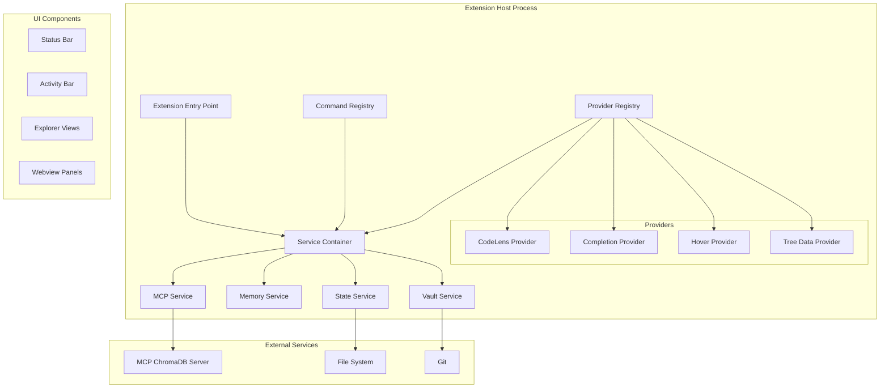
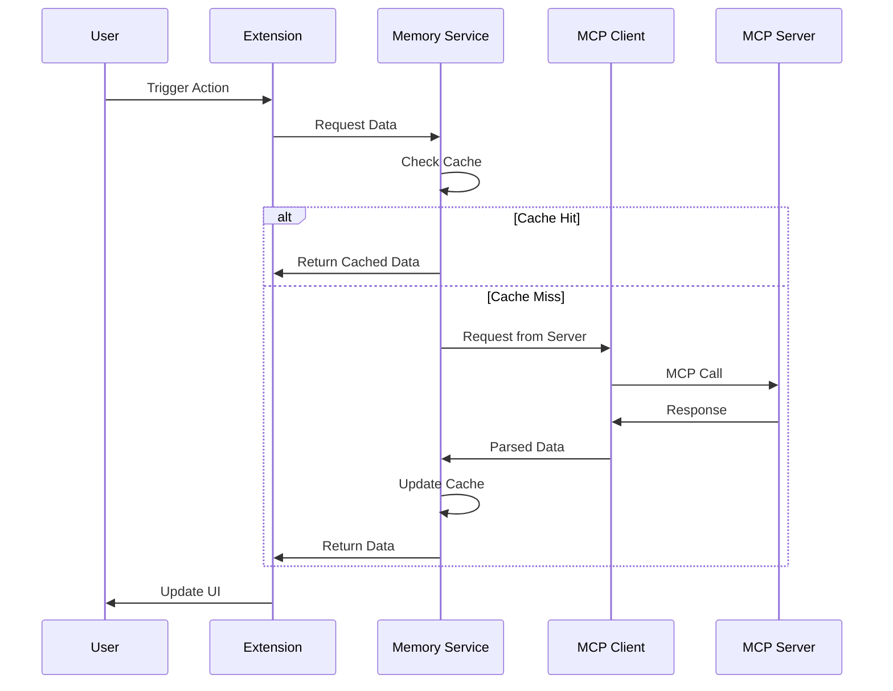

# VS Code Extension Architecture

## Overview

The Cognitive Memory VS Code Extension follows a modular architecture designed for maintainability, testability, and extensibility.

## Core Architecture Principles

1. **Separation of Concerns**: Clear boundaries between UI, business logic, and MCP communication
2. **Dependency Injection**: Loosely coupled components for easier testing
3. **Event-Driven**: Reactive programming for UI updates and state management
4. **Performance First**: Lazy loading, caching, and efficient data structures

## Component Architecture



## Service Layer Design

### Service Container
```typescript
export class ServiceContainer {
  private services: Map<string, any> = new Map();
  
  register<T>(token: string, factory: () => T): void {
    this.services.set(token, factory());
  }
  
  get<T>(token: string): T {
    return this.services.get(token);
  }
}
```

### Core Services

#### MCP Service
- Manages connection to MCP server
- Handles authentication and retry logic
- Provides typed API wrapper
- Implements connection pooling

#### Memory Service
- Caches frequently accessed memories
- Implements search algorithms
- Manages memory lifecycle
- Provides real-time updates

#### State Service
- Captures workspace state
- Manages state persistence
- Implements state diff algorithm
- Handles state restoration

#### Vault Service
- Manages vault registry
- Implements vault switching
- Handles backup/restore
- Provides vault statistics

## Provider Architecture

### Base Provider Pattern
```typescript
abstract class BaseProvider<T> implements vscode.TreeDataProvider<T> {
  protected _onDidChangeTreeData: vscode.EventEmitter<T | undefined>;
  readonly onDidChangeTreeData: vscode.Event<T | undefined>;
  
  constructor(protected context: vscode.ExtensionContext) {
    this._onDidChangeTreeData = new vscode.EventEmitter<T | undefined>();
    this.onDidChangeTreeData = this._onDidChangeTreeData.event;
  }
  
  abstract getTreeItem(element: T): vscode.TreeItem;
  abstract getChildren(element?: T): Thenable<T[]>;
  
  refresh(): void {
    this._onDidChangeTreeData.fire(undefined);
  }
}
```

### Language Feature Providers

#### CodeLens Provider
- Shows memory associations
- Displays modification history
- Provides quick actions
- Updates in real-time

#### Completion Provider
- Suggests from memory patterns
- Context-aware filtering
- Learning from usage
- Performance optimized

#### Hover Provider
- Shows related memories
- Displays documentation
- Provides quick links
- Minimal latency

## Data Flow Architecture



## State Management

### Extension State
```typescript
interface ExtensionState {
  connection: ConnectionState;
  memories: MemoryState;
  vaults: VaultState;
  ui: UIState;
}

class StateManager {
  private state: ExtensionState;
  private subscribers: Set<StateSubscriber>;
  
  dispatch(action: Action): void {
    this.state = reducer(this.state, action);
    this.notify();
  }
  
  subscribe(subscriber: StateSubscriber): void {
    this.subscribers.add(subscriber);
  }
}
```

### Persistence Strategy
- Extension global state: VS Code API
- User preferences: Settings
- Cache data: Extension storage
- Temporary data: Memory

## Performance Optimization

### Caching Strategy
```typescript
class CacheManager<T> {
  private cache: Map<string, CacheEntry<T>>;
  private maxSize: number;
  private ttl: number;
  
  async get(key: string, factory: () => Promise<T>): Promise<T> {
    const entry = this.cache.get(key);
    
    if (entry && !this.isExpired(entry)) {
      return entry.value;
    }
    
    const value = await factory();
    this.set(key, value);
    return value;
  }
}
```

### Lazy Loading
- Views load on demand
- Providers initialize when needed
- Heavy operations deferred
- Resources loaded progressively

### Memory Management
- Implement LRU cache eviction
- Monitor memory usage
- Clean up on deactivation
- Prevent memory leaks

## Error Handling

### Error Boundaries
```typescript
class ErrorBoundary {
  static async wrap<T>(
    operation: () => Promise<T>,
    fallback?: T
  ): Promise<T> {
    try {
      return await operation();
    } catch (error) {
      Logger.error('Operation failed', error);
      ErrorReporter.report(error);
      
      if (fallback !== undefined) {
        return fallback;
      }
      
      throw new UserFriendlyError(error);
    }
  }
}
```

### Retry Strategy
- Exponential backoff for network errors
- Circuit breaker for repeated failures
- User notification for persistent errors
- Graceful degradation

## Security Considerations

### Data Protection
- Sanitize user input
- Validate MCP responses
- Secure credential storage
- Encrypt sensitive data

### API Security
- Use secure communication
- Implement rate limiting
- Validate permissions
- Audit logging

## Testing Architecture

### Unit Testing
```typescript
describe('MemoryService', () => {
  let service: MemoryService;
  let mockClient: MockMCPClient;
  
  beforeEach(() => {
    mockClient = new MockMCPClient();
    service = new MemoryService(mockClient);
  });
  
  it('should cache search results', async () => {
    const results = await service.search('test');
    const cached = await service.search('test');
    
    expect(mockClient.calls).toBe(1);
    expect(results).toEqual(cached);
  });
});
```

### Integration Testing
- Test with real MCP server
- Verify UI updates
- Test error scenarios
- Performance benchmarks

## Deployment Architecture

### Bundle Strategy
- Webpack for production builds
- Tree shaking for size optimization
- Code splitting for lazy loading
- Source maps for debugging

### Release Pipeline
- Automated testing
- Bundle analysis
- Version management
- Marketplace deployment

## Monitoring and Analytics

### Telemetry
```typescript
class Analytics {
  static track(event: string, properties?: any): void {
    if (userConsent) {
      telemetryReporter.sendTelemetryEvent(event, properties);
    }
  }
}
```

### Performance Monitoring
- Track operation latency
- Monitor memory usage
- Log error rates
- User interaction metrics

## Future Architecture Considerations

### Extensibility
- Plugin system for custom providers
- Theme support for UI
- Custom memory sources
- API for third-party integration

### Scalability
- Support for large memory sets
- Distributed caching
- Background processing
- Multi-instance synchronization