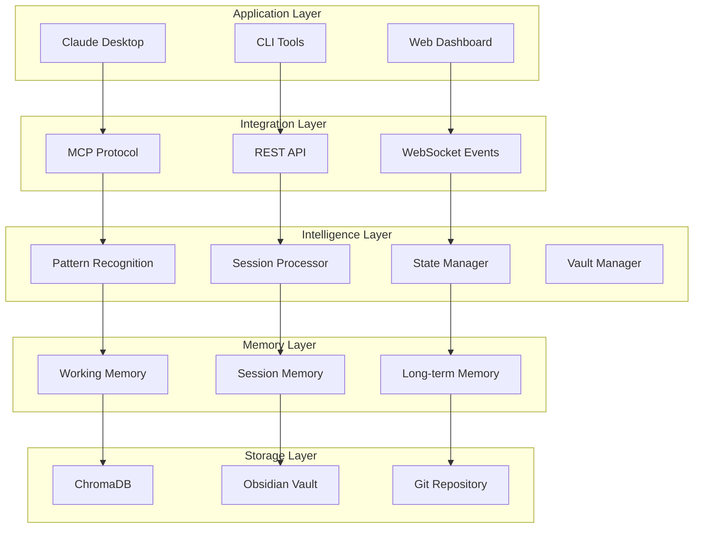

# 🧠 MCP ChromaDB Memory Server - Cognitive State Management Platform

<div align="center">

[](https://modelcontextprotocol.io)
[](https://www.trychroma.com/)
[](https://www.typescriptlang.org/)
[](https://www.docker.com/)
[](LICENSE)

A comprehensive **Cognitive State Management Platform** that transforms how developers preserve context, manage knowledge, and maintain continuity across projects, sessions, and teams.

[Features](#features) • [Platform Vision](#platform-vision) • [Installation](#installation) • [Usage](#usage) • [API](#api) • [Architecture](#architecture) • [Contributing](#contributing)

</div>

---

## 🌟 Overview

The MCP ChromaDB Memory Server has evolved from a simple memory storage tool into a comprehensive **Cognitive State Management Platform**. It intelligently captures, organizes, and retrieves development knowledge while maintaining full project context across sessions, devices, and team members. The platform enables AI assistants like Claude to maintain persistent, intelligent memory with sophisticated hierarchical organization and automatic learning from development patterns.

## 🚀 Platform Vision

This project implements a complete cognitive platform that:

- **Preserves Context**: Never lose your mental state when switching tasks or devices
- **Learns from Usage**: Automatically extracts patterns and insights from development sessions
- **Scales Intelligently**: Hierarchical memory system optimized for performance
- **Integrates Deeply**: Works seamlessly with your existing development workflow

See [Platform Approach](./Project_Context/Platform%20Approach%20-%20Cognitive%20State%20Management.md) for detailed vision.

### Platform Capabilities

#### Current Features
- 🤖 **Autonomous Storage** - AI-assessed importance determines what gets stored
- 🔍 **Intelligent Retrieval** - Multi-factor scoring combines semantic similarity, recency, importance, and access frequency
- 🎯 **Context-Aware** - Supports different memory contexts (general, user preferences, critical tasks, notes)
- 📊 **Smart Scoring** - Retrieval uses weighted scoring: Semantic (40%), Recency (30%), Importance (20%), Frequency (10%)
- 🔎 **Exact Search** - Fast string matching with keyword indexing for precise lookups
- 🔀 **Hybrid Search** - Combines exact and semantic search with configurable weights
- 🗜️ **Token Optimization** - Smart compression (50-90% reduction) while preserving important content
- 📈 **Access Pattern Analysis** - Track hot/warm/cold memories with tier recommendations
- 📝 **Obsidian Integration** - Read, write, and search notes in your Obsidian vault with semantic search
- 📚 **Session Logging** - Automatically log Claude Code conversations to Obsidian with summaries and code highlights
- 📋 **Template System** - Import and manage documentation templates from webhooks with Handlebars support
- 🏗️ **Hierarchical Vault Structure** - Universal Developer Documentation System with automated folder generation and hooks
- 🏥 **Health Monitoring** - Real-time system health checks with visual dashboard and startup verification
- 📊 **Vault Index** - Comprehensive vault statistics and navigation system with automatic updates

#### Platform Enhancements (Coming Soon)
- 🏗️ **Hierarchical Memory System** - Three-tier architecture (Working, Session, Long-term) with automatic migration
- 🔄 **Vault Management** - Multi-project support with instant context switching
- 💾 **State Capture** - Save and restore complete working context across devices
- 🧬 **Pattern Recognition** - Learn from development patterns and suggest solutions
- 🔄 **Memory Consolidation** - Intelligent deduplication and memory merging
- 🔀 **Git Integration** - Link memories to commits, branches, and pull requests

## 📋 Requirements

- Node.js 20+
- Docker & Docker Compose
- OpenAI API key (for embeddings)
- 2GB RAM minimum
- Windows/macOS/Linux

## 📖 Quick References

- **[Memory Usage Guide](./MEMORY_USAGE_GUIDE.md)** - Learn how to effectively use the memory system
- **[Dual Instance Setup](./Project_Context/DUAL_INSTANCE_SETUP.md)** - Set up isolated development environment
- **[Development Status](./Project_Context/DEVELOPMENT_STATUS.md)** - Current progress and roadmap

## 🚀 Quick Start

### Using Docker Compose (Recommended)

1. **Clone the repository**
   ```bash
   git clone https://github.com/stevenjjobson/mcp-chromadb-memory.git
   cd mcp-chromadb-memory
   ```

2. **Set up environment**
   ```bash
   cp .env.example .env
   # Edit .env and add your OpenAI API key
   ```

3. **Start services**
   ```bash
   # For Claude Desktop - start only ChromaDB
   docker-compose up -d chromadb
   
   # Or use the convenience script (Windows)
   .\start-chromadb.ps1
   ```
   
   **Note**: Claude Desktop creates its own MCP container automatically. You only need ChromaDB running.

4. **Verify installation**
   ```bash
   docker-compose logs -f chromadb-memory
   ```

> **Note**: The MCP server container will exit immediately when run standalone. This is normal behavior - MCP servers communicate via stdio and need a client to connect. Use the Claude Desktop configuration below to properly connect to the server.

### Local Development Setup

1. **Install dependencies**
   ```bash
   npm install
   ```

2. **Start ChromaDB**
   ```bash
   docker-compose up -d chromadb
   ```

3. **Build and run**
   ```bash
   npm run build
   npm run dev
   ```

## 🚀 Quick Start with WSL

### Using the Startup Script (Recommended)

For WSL users, we provide a comprehensive startup script that ensures all services are running correctly:

```bash
# Make the script executable (first time only)
chmod +x start-mcp-platform.sh

# Run the startup script
./start-mcp-platform.sh
```

The script will:
- ✅ Verify Docker is running
- ✅ Check ChromaDB status and start if needed
- ✅ Validate environment configuration
- ✅ Build TypeScript if needed
- ✅ Run health checks
- ✅ Display a visual dashboard
- ✅ Optionally launch Claude Desktop when ready

See [WSL Startup Guide](./Project_Context/vault/Knowledge/Setup/WSL_STARTUP_GUIDE.md) for detailed information.

## 🔧 Configuration

### Environment Variables

Create a `.env` file in the project root:

```env
# ChromaDB Configuration
CHROMA_HOST=chromadb          # Use 'localhost' for local development
CHROMA_PORT=8000

# OpenAI Configuration (required for embeddings)
# API key is stored securely in Docker secrets - see Security section below

# Obsidian Integration (optional)
OBSIDIAN_VAULT_PATH=/path/to/your/vault

# Memory Configuration
MEMORY_IMPORTANCE_THRESHOLD=0.7    # Minimum importance score to store (0-1)
MEMORY_COLLECTION_NAME=ai_memories
MAX_MEMORY_RESULTS=10

# Server Configuration
MCP_SERVER_NAME=ai-memory-server
MCP_SERVER_VERSION=1.0.0
```

### Claude Desktop Integration

1. **Locate the configuration file**:
   - Windows: `%APPDATA%\Claude\claude_desktop_config.json`
   - macOS: `~/Library/Application Support/Claude/claude_desktop_config.json`
   - Linux: `~/.config/Claude/claude_desktop_config.json`

2. **Add the MCP server configuration**:

```json
{
  "mcpServers": {
    "memory": {
      "command": "docker",
      "args": [
        "run",
        "-i",
        "--rm",
        "--network", "mcp-chromadb-memory_memory-network",
        "-v", "C:/Users/Steve/Dockers/mcp-chromadb-memory/Project_Context/vault:/vault:rw",
        "-e", "DOCKER_CONTAINER=true",
        "-e", "CHROMA_HOST=chromadb",
        "-e", "CHROMA_PORT=8000",
        "-e", "OBSIDIAN_VAULT_PATH=/vault",
        "-e", "AUTO_START_SESSION_LOGGING=true",
        "-e", "SESSION_LOGGING_PROJECT_NAME=MCP ChromaDB Memory",
        "mcp-chromadb-memory-mcp-memory"
      ]
    }
  }
}
```

3. **Restart Claude Desktop** to load the new configuration

For local development without Docker:
```json
{
  "mcpServers": {
    "memory-local": {
      "command": "node",
      "args": ["C:\\path\\to\\mcp-chromadb-memory\\dist\\index.js"],
      "env": {
        "OPENAI_API_KEY": "your-api-key-here",
        "CHROMA_HOST": "localhost",
        "CHROMA_PORT": "8000"
      }
    }
  }
}
```

## 📚 API Reference

### Tools

#### `store_memory`
Stores information based on AI-assessed importance.

```typescript
{
  content: string;      // The information to store
  context?: string;     // Context category (general, user_preference, task_critical, obsidian_note)
  metadata?: object;    // Additional metadata
}
```

**Response:**
```json
{
  "stored": true,
  "id": "mem_1234567890_abc",
  "importance": 0.85
}
```

#### `recall_memories`
Retrieves relevant memories with context-aware filtering.

```typescript
{
  query: string;        // Search query
  context?: string;     // Optional context filter
  limit?: number;       // Max results (default: 5)
}
```

**Response:**
```json
[
  {
    "content": "User prefers dark mode interfaces",
    "context": "user_preference",
    "importance": "0.80",
    "timestamp": "2024-01-15T10:30:00Z",
    "scores": {
      "total": "0.825",
      "semantic": "0.920",
      "recency": "0.750",
      "importance": "0.800",
      "frequency": "0.600"
    }
  }
]
```

#### `health_check`
Verifies server status and ChromaDB connection.

**Response:**
```json
{
  "status": "ok",
  "chromadb_connected": true,
  "server_version": "1.0.0",
  "platform": "linux",
  "docker": true
}
```

### Session Logging Tools

#### `start_session_logging`
Begins logging a Claude Code session to Obsidian.

```typescript
{
  project?: string;     // Project name (default: "General")
}
```

#### `save_session_log`
Saves the current session to Obsidian with auto-generated summary.

```typescript
{
  summary?: string;     // Optional manual summary
}
```

#### `log_session_event`
Manually logs specific events during the session.

```typescript
{
  type: string;         // Event type: user, assistant, tool, decision, achievement
  content: string;      // Event content
  metadata?: object;    // Additional metadata
}
```

**Automatic Session Logging**: Set `AUTO_START_SESSION_LOGGING=true` in your environment to automatically start logging when Claude Code connects. The session will be auto-saved on exit if `SESSION_LOGGING_SAVE_ON_EXIT=true` (default).

See [SESSION_LOGGING.md](./Project_Context/vault/Knowledge/Setup/SESSION_LOGGING.md) for detailed usage.

### Template Management Tools

#### `import_template`
Import a documentation template from an external webhook source.

```typescript
{
  source: string;        // URL of the template to import
  category?: string;     // Template category (session, decision, pattern, etc.)
  variables?: object;    // Variables to apply immediately
  saveAs?: string;       // Filename to save generated document
}
```

#### `list_templates`
List all available templates in the system.

```typescript
{
  category?: string;     // Filter by category
  source?: string;       // Filter by source URL
}
```

#### `apply_template`
Apply a template with variables to generate a document.

```typescript
{
  templateId: string;    // ID of the template
  variables: object;     // Variables to apply
  outputPath: string;    // Where to save the document
}
```

#### `configure_template_webhook`
Configure a webhook source for importing templates.

```typescript
{
  name: string;          // Name for this webhook
  url: string;           // Webhook URL
  authType?: string;     // Authentication type (none, bearer, api-key, oauth)
  authCredentials?: string; // Auth credentials
  syncInterval?: number; // Auto-sync interval in minutes
}
```

#### `sync_templates`
Synchronize templates from all configured webhook sources.

```typescript
// No parameters required
```

See [Template System Design](./Project_Context/Template%20System%20Design.md) for detailed architecture.

### Vault Structure Management Tools

#### `import_vault_structure`
Import a complete vault structure definition with templates and hooks.

```typescript
{
  source: string;              // URL or path to structure definition
  applyImmediately?: boolean;  // Apply structure after import
  targetPath?: string;         // Target path (defaults to vault)
}
```

#### `generate_vault_structure`
Generate folder hierarchy from a loaded structure template.

```typescript
{
  structureId?: string;        // Structure name/ID
  targetPath: string;          // Where to generate
  options?: {
    skipExisting?: boolean;    // Skip existing folders
    dryRun?: boolean;          // Preview without changes
    applyTemplates?: boolean;  // Apply folder templates
  }
}
```

#### `apply_folder_hooks`
Apply hooks to existing folders for automated actions.

```typescript
{
  folderPath: string;          // Folder to apply hooks to
  hookIds?: string[];          // Specific hooks (or all)
}
```

See [Hierarchical Vault Structure System](./Project_Context/Hierarchical%20Vault%20Structure%20System.md) for complete documentation.

## 🏗️ Architecture

### Current Architecture

```
mcp-chromadb-memory/
├── src/
│   ├── index.ts              # MCP server entry point
│   ├── config.ts             # Configuration management
│   ├── memory-manager.ts     # ChromaDB operations & memory logic
│   ├── obsidian-manager.ts   # Obsidian vault integration
│   ├── session-logger.ts     # Session capture and logging
│   ├── template-manager.ts   # Template system with webhook support
│   ├── vault-manager.ts      # Vault management wrapper
│   └── services/
│       └── http-client.ts    # HTTP client for webhooks
├── Project_Context/
│   ├── vault/               # Project-specific Obsidian vault
│   │   └── Templates/       # Documentation templates
│   └── *.md                 # Platform documentation
├── dist/                    # Compiled JavaScript
├── docker-compose.yml       # Container orchestration
└── Dockerfile              # Container definition
```

### Platform Architecture (v2.0)



See [Implementation Roadmap](./Project_Context/Implementation%20Roadmap.md) for transformation details.

### Memory Scoring Algorithm

The retrieval system uses a sophisticated multi-factor scoring approach:

- **Semantic Similarity (40%)**: Cosine similarity between query and memory embeddings
- **Recency Score (30%)**: Exponential decay based on time since last access
- **Importance Score (20%)**: AI-assessed importance during storage
- **Frequency Score (10%)**: Logarithmic scaling of access count

## 🛠️ Development

### Dual-Instance Development

For safe testing of new features, use the isolated development environment:

```bash
# Start development environment
./scripts/env-manager.sh start-dev

# Check status
./scripts/env-manager.sh status

# Run in development mode
./scripts/test-hierarchical.sh
```

This creates a completely separate ChromaDB instance on port 8001 with its own data and configuration.

### Available Scripts

```bash
npm run build         # Compile TypeScript
npm run dev          # Run with hot reload
npm run test         # Run test suite
npm run inspect      # Test with MCP Inspector
npm run docker:build # Build Docker image
npm run docker:run   # Run in Docker
```

### Testing with MCP Inspector

```bash
npm run inspect
```

Then in the inspector:
1. Call `health_check` to verify connection
2. Use `store_memory` to save test memories
3. Use `recall_memories` to test retrieval

## 🔧 Troubleshooting

### MCP Server Not Appearing in Claude Desktop

1. **Verify configuration file location**:
   - Windows: `%APPDATA%\Claude\claude_desktop_config.json`
   - Ensure JSON syntax is valid (no trailing commas)

2. **Check Docker setup**:
   ```bash
   docker images | grep mcp-chromadb-memory
   docker network ls | grep memory-network
   ```

3. **Ensure ChromaDB is running**:
   ```bash
   docker-compose ps
   ```

4. **Test manually**:
   ```bash
   docker run -it --rm \
     --network mcp-chromadb-memory_memory-network \
     -e OPENAI_API_KEY=your-key \
     mcp-chromadb-memory-mcp-memory
   ```

### Common Issues

- **"Container exits immediately"**: This is normal for MCP servers - they run on-demand
- **"Cannot connect to ChromaDB"**: Ensure ChromaDB container is healthy
- **"Missing OpenAI API key"**: Check your .env file or Docker environment variables

## 🤝 Contributing

Contributions are welcome! Please feel free to submit a Pull Request.

### 🚀 Platform v2.0 Development

We're actively developing the next major version that transforms this into a Cognitive State Management Platform. To contribute:

```bash
# Platform development branch
git checkout feature/platform-transformation
git pull origin feature/platform-transformation
```

### Contributing Process

1. Fork the repository
2. Switch to platform branch (`git checkout feature/platform-transformation`)
3. Create your feature branch (`git checkout -b feature/AmazingFeature`)
3. Commit your changes (`git commit -m 'Add some AmazingFeature'`)
4. Push to the branch (`git push origin feature/AmazingFeature`)
5. Open a Pull Request

## 📄 License

This project is licensed under the MIT License - see the [LICENSE](LICENSE) file for details.

## 🙏 Acknowledgments

- Built on the [Model Context Protocol](https://modelcontextprotocol.io) by Anthropic
- Powered by [ChromaDB](https://www.trychroma.com/) for vector storage
- Uses [OpenAI Embeddings](https://platform.openai.com/docs/guides/embeddings) for semantic search

## 📞 Support

- 🐛 [Report bugs](https://github.com/stevenjjobson/mcp-chromadb-memory/issues)
- 💡 [Request features](https://github.com/stevenjjobson/mcp-chromadb-memory/issues)
- 📖 [Documentation](https://github.com/stevenjjobson/mcp-chromadb-memory/wiki)

## 📚 Additional Documentation

The project documentation has been organized into the vault structure:

- **Setup Guides**: See `Project_Context/vault/Knowledge/Setup/` for:
  - Docker setup and troubleshooting
  - WSL configuration guide
  - Security setup instructions
  - Health monitoring documentation
  - Session logging guide
  
- **Architecture**: See `Project_Context/vault/Architecture/` for design decisions and patterns

- **Historical Docs**: See `Project_Context/vault/Archive/` for previous development history

---

<div align="center">
Made with ❤️ for the MCP ecosystem
</div>