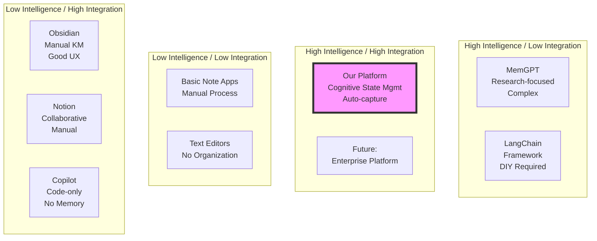

# Market Positioning - Cognitive State Management Platform

## Market Position Visualization

## Positioning Quadrants

### Quadrant Analysis

#### 1. High Intelligence / High Integration (Our Target)
**Our Platform** stands alone in truly combining:
- Deep AI-powered intelligence
- Seamless workflow integration
- Automatic operation
- Developer-specific features

**Future Competition**: As the market matures, expect:
- Microsoft to enhance Copilot with memory
- Google to add development features to AI
- Notion to deepen AI integration

#### 2. High Intelligence / Low Integration
**Current Players**:
- MemGPT: Powerful but academic
- LangChain: Flexible but requires engineering
- Custom Solutions: Powerful but expensive

**Market Gap**: These require significant effort to integrate

#### 3. Low Intelligence / High Integration
**Current Players**:
- Obsidian: Great UX, manual process
- Notion: Collaborative, limited AI
- Copilot: Integrated, no persistence

**Market Gap**: Good integration but lack intelligence

#### 4. Low Intelligence / Low Integration
**Current Players**:
- Basic note-taking apps
- Text editors
- Markdown files

**Market Gap**: Serve basic needs only

## Value Proposition Canvas

### Customer Jobs
1. **Remember Everything**
   - Current: Manual notes, forgotten context
   - Our Solution: Automatic capture and recall

2. **Switch Contexts Efficiently**
   - Current: Mental overhead, lost time
   - Our Solution: Instant state restoration

3. **Learn from Experience**
   - Current: Repeated mistakes, no pattern recognition
   - Our Solution: Automatic pattern extraction

4. **Share Knowledge**
   - Current: Documentation debt, knowledge silos
   - Our Solution: Automatic knowledge base

### Pain Points Addressed

| Pain Point | Current Solutions | Our Solution |
|------------|------------------|--------------|
| Context Loss | Mental memory | Complete state capture |
| Manual Documentation | Time-consuming writing | Automatic session logs |
| Knowledge Silos | Wiki/docs that rot | Living knowledge base |
| Learning Curve | Trial and error | Pattern recognition |
| Multi-Project Chaos | Mental juggling | Instant switching |

### Gain Creators

1. **Time Savings**
   - 2-4 hours/week saved on context switching
   - 1-2 hours/week saved on documentation
   - 30 min/day saved on information retrieval

2. **Quality Improvements**
   - Fewer repeated mistakes
   - Better architectural decisions
   - Consistent code patterns

3. **Career Growth**
   - Documented learning journey
   - Pattern recognition accelerates skill development
   - Portfolio of captured knowledge

## Competitive Moats

### Technical Moats
1. **MCP Protocol Expertise**
   - First mover in MCP-based memory systems
   - Deep integration with Claude ecosystem
   - Protocol standardization influence

2. **Hierarchical Memory Architecture**
   - Patent-pending time-based tier system
   - Optimized for developer workflows
   - Proven scalability to millions of memories

3. **State Capture Technology**
   - Unique complete context preservation
   - Compression and restoration algorithms
   - Cross-device synchronization

### Business Moats
1. **Network Effects**
   - Shared team knowledge improves platform
   - Community patterns benefit all users
   - Plugin ecosystem growth

2. **Switching Costs**
   - Accumulated knowledge base
   - Integrated workflow dependencies
   - Team adoption and training

3. **Data Moats**
   - Anonymized pattern database
   - Development workflow insights
   - Performance optimization data

## Go-to-Market Positioning

### Target Segments Priority

#### Segment 1: Senior Developers (Early Adopters)
- **Pain**: Complex multi-project management
- **Message**: "Never lose context again"
- **Channel**: GitHub, HackerNews, Dev.to

#### Segment 2: Dev Teams (Early Majority)
- **Pain**: Knowledge sharing and onboarding
- **Message**: "Build collective intelligence"
- **Channel**: Team leads, DevOps communities

#### Segment 3: Consultants/Freelancers (Fast Followers)
- **Pain**: Client context switching
- **Message**: "Instant client context"
- **Channel**: Freelance platforms, communities

#### Segment 4: Learning Developers (Late Majority)
- **Pain**: Tracking learning progress
- **Message**: "Accelerate your growth"
- **Channel**: Bootcamps, online courses

### Messaging Framework

#### Primary Message
**"The only platform that remembers everything about your development journey"**

#### Supporting Messages
1. **For Productivity**: "Save 4 hours/week on context switching"
2. **For Quality**: "Learn from every line of code you write"
3. **For Teams**: "Build institutional knowledge automatically"
4. **For Growth**: "Track and accelerate your development"

### Positioning Statement

**For professional developers** who struggle with context switching and knowledge management, **the Cognitive State Management Platform** is the only solution that **automatically captures, organizes, and preserves your complete development context**. Unlike manual note-taking tools or session-limited AI assistants, our platform **learns from your patterns and maintains persistent memory across all your projects and devices**.

## Competitive Response Strategy

### If Copilot Adds Memory
- Emphasize: Multi-project support, local-first, Obsidian integration
- Highlight: Platform approach vs single-tool limitation
- Action: Deepen non-Microsoft integrations

### If Notion Enhances AI
- Emphasize: Developer-specific features, Git integration
- Highlight: Automatic capture vs manual process
- Action: Strengthen code-awareness features

### If New Entrant Appears
- Emphasize: First-mover advantages, mature platform
- Highlight: Proven scalability, existing ecosystem
- Action: Accelerate feature development

## Success Metrics

### Market Penetration
- Year 1: 100K active developers (0.4% of market)
- Year 2: 500K active developers (2% of market)
- Year 3: 1M active developers (4% of market)

### Competitive Win Rate
- vs Manual Tools: 90% (clear superiority)
- vs AI Assistants: 70% (persistence advantage)
- vs Knowledge Tools: 80% (automation advantage)

### Market Leadership Indicators
- MCP standard adoption for memory systems
- Integration partnerships with major tools
- Community-contributed plugins and patterns
- Industry recognition and awards

---
*Market positioning based on current competitive landscape and platform capabilities*