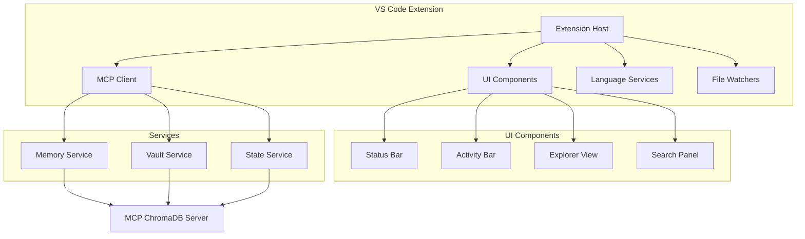

# VS Code Extension Roadmap - Cognitive State Management

## Overview

This roadmap outlines the development of a VS Code extension that serves as a powerful front-end for the MCP ChromaDB Memory Server, transforming VS Code into a cognitive development environment that remembers and learns from your development history.

**Current Status**: Initial setup complete for CoachNTT VSCode Extension (2025-01-09)
- ✅ Build infrastructure working
- ✅ VSIX packaging successful (3.1 MB)
- ✅ Basic UI with placeholder functionality
- 🚧 Ready for core service implementation

## Vision

Create the first IDE extension that provides:
- **Persistent cognitive state** across development sessions
- **Intelligent memory-based code suggestions**
- **Visual development history and state management**
- **Team knowledge integration** within the IDE

## Architecture Overview



## Development Phases

### Phase 1: Foundation (Weeks 1-2) 🚧 WEEK 1 COMPLETE, WEEK 2 IN PROGRESS

#### Objectives
- Establish core extension architecture
- Implement MCP client connection
- Create basic command palette integration
- Set up development environment

#### Deliverables

##### Week 1: Extension Scaffold
- [x] Initialize VS Code extension project ✅ (CoachNTT)
- [x] Set up TypeScript configuration ✅
- [x] Configure bundling (webpack/esbuild) ✅
- [x] Implement basic activation events ✅
- [x] Create extension configuration schema ✅

##### Week 2: MCP Integration
- [ ] Implement MCP client wrapper (ready to implement)
- [ ] Create connection manager with retry logic (architecture planned)
- [x] Add status bar with connection indicator ✅ (UI complete, needs backend)
- [x] Implement basic command palette commands: ✅ (all 18 commands registered)
  - `Cognitive: Connect to Server`
  - `Cognitive: Health Check`
  - `Cognitive: Store Memory`
  - `Cognitive: Search Memories`

#### Technical Specifications
```typescript
// Extension architecture
interface CognitiveExtension {
  // Core services
  mcpClient: MCPClient;
  connectionManager: ConnectionManager;
  configManager: ConfigurationManager;
  
  // Commands
  commands: Map<string, Command>;
  
  // UI elements
  statusBar: StatusBarManager;
}

// MCP client wrapper
class MCPClient {
  constructor(private config: MCPConfig) {}
  
  async connect(): Promise<void>;
  async call(tool: string, args: any): Promise<any>;
  async disconnect(): Promise<void>;
}
```

### Phase 2: Visual Interface (Weeks 3-4) - READY TO START

#### Objectives
- Create comprehensive UI for memory exploration
- Implement vault management interface
- Add state timeline visualization
- Design intuitive user interactions

#### Deliverables

##### Week 3: Activity Bar & Explorer
- [x] Add custom Activity Bar icon ✅ (brain icon implemented)
- [x] Create Memory Explorer tree view ✅ (mock data, needs real backend)
  - Recent memories
  - Categorized memories
  - Search functionality
- [ ] Implement Vault Manager view
  - List vaults
  - Switch active vault
  - Create/delete vaults
- [ ] Add refresh and filter capabilities

##### Week 4: State Management UI
- [ ] Create State Timeline view
  - Visual timeline of captures
  - State preview on hover
  - Quick restore actions
- [ ] Implement State Diff viewer
- [ ] Add memory search webview panel
- [ ] Create settings UI for extension config

#### UI Mockups

##### Memory Explorer
```
🧠 COGNITIVE MEMORY
├── 📊 Statistics
│   └── Total: 1,247 memories
├── 🕐 Recent Memories
│   ├── Fixed auth bug (2h ago)
│   ├── Updated user service (1d ago)
│   └── Refactored database (3d ago)
├── 🏷️ Categories
│   ├── task_critical (45)
│   ├── code_snippet (234)
│   └── user_preference (23)
└── 🔍 Search...
```

##### State Timeline
```
📅 STATE TIMELINE
┌─────────────────────────────┐
│ ← November 2024 →           │
├─────────────────────────────┤
│ 28 │ ● ● ○ ● ● ● ○ ○      │
│ 27 │ ● ○ ● ● ○ ○ ○ ○      │
│ 26 │ ● ● ● ○ ○ ○ ○ ○      │
└─────────────────────────────┘
● = State captured
○ = No state

Selected: "Pre-deployment state"
Files: 47 | Memories: 1,232
[Preview] [Restore] [Compare]
```

### Phase 3: Editor Integration (Weeks 5-6)

#### Objectives
- Enhance code editor with memory-powered features
- Implement intelligent suggestions
- Add visual indicators for memory associations
- Create seamless editing experience

#### Deliverables

##### Week 5: Editor Enhancements
- [ ] Implement CodeLens provider
  - Show memory count above functions/classes
  - Display last modification info
  - Quick access to related memories
- [ ] Create Hover provider
  - Show related memories on hover
  - Display past implementations
  - Show team knowledge
- [ ] Add Decoration provider
  - Highlight code with memories
  - Visual indicators for patterns

##### Week 6: Intelligent Features
- [ ] Implement Completion provider
  - Suggest from memory patterns
  - Context-aware completions
  - Learn from acceptance/rejection
- [ ] Create Code Action provider
  - "Store as memory" action
  - "Find similar" action
  - "Apply pattern" action
- [ ] Add Diagnostic provider
  - Detect inconsistencies
  - Suggest improvements
  - Warn about deprecated patterns

#### Code Examples

```typescript
// CodeLens example
class UserService {
  // 📊 12 memories | Last modified: 2 days ago | View history
  async createUser(data: UserData) {
    // Implementation
  }
}

// Inline suggestion example
function calculateTotal(items) {
  // 💡 Similar implementation found in 3 memories
  // → items.reduce((sum, item) => sum + item.price, 0)
  
}
```

### Phase 4: Intelligence Features (Weeks 7-8)

#### Objectives
- Implement automatic state capture
- Create pattern recognition system
- Integrate with AI assistants
- Enable team collaboration

#### Deliverables

##### Week 7: Automation & Patterns
- [ ] Implement auto-capture system
  - On git operations
  - During debug sessions
  - Task completion detection
  - Configurable triggers
- [ ] Create pattern detection
  - Code pattern analysis
  - Workflow pattern recognition
  - Anomaly detection
- [ ] Add smart notifications
  - Suggest relevant memories
  - Warn about conflicts
  - Recommend best practices

##### Week 8: AI & Collaboration
- [ ] Integrate with AI assistants
  - Feed context to Copilot
  - Enhance Codeium suggestions
  - Custom AI prompts with memory
- [ ] Implement team features
  - Shared vault access
  - Team pattern library
  - Knowledge attribution
- [ ] Add analytics dashboard
  - Memory usage stats
  - Pattern effectiveness
  - Team insights

#### Intelligence Features

```typescript
// Auto-capture configuration
{
  "cognitive.autoCapture": {
    "onCommit": true,
    "onDebugStart": true,
    "onTaskComplete": true,
    "interval": "hourly",
    "filters": {
      "minChanges": 10,
      "excludePaths": ["node_modules", "dist"]
    }
  }
}

// Pattern detection example
interface DetectedPattern {
  type: "code" | "workflow" | "architecture";
  pattern: string;
  confidence: number;
  occurrences: Location[];
  suggestion: string;
}
```

## Technical Implementation

### Extension Structure
```
vscode-cognitive-memory/
├── src/
│   ├── extension.ts          # Entry point
│   ├── client/
│   │   ├── mcpClient.ts      # MCP client wrapper
│   │   └── connection.ts     # Connection management
│   ├── providers/
│   │   ├── codeLens.ts       # CodeLens provider
│   │   ├── completion.ts     # Completion provider
│   │   ├── hover.ts          # Hover provider
│   │   └── treeData.ts       # Tree data providers
│   ├── views/
│   │   ├── memoryExplorer.ts # Memory explorer
│   │   ├── stateTimeline.ts  # State timeline
│   │   └── searchPanel.ts    # Search interface
│   ├── services/
│   │   ├── autoCapture.ts    # Auto-capture logic
│   │   ├── patternMatcher.ts # Pattern detection
│   │   └── analytics.ts      # Usage analytics
│   └── utils/
│       ├── config.ts         # Configuration
│       └── logger.ts         # Logging utilities
├── resources/
│   ├── icons/                # Extension icons
│   └── webview/              # Webview assets
├── package.json              # Extension manifest
└── README.md                 # Documentation
```

### Key APIs and Integration Points

#### VS Code APIs
- `vscode.languages.*` - Language features
- `vscode.window.*` - UI components
- `vscode.workspace.*` - Workspace management
- `vscode.commands.*` - Command registration
- `vscode.ExtensionContext` - Extension lifecycle

#### MCP Integration
```typescript
// Tool calls to MCP server
await mcpClient.call('store_memory', {
  content: selectedText,
  context: 'code_snippet',
  metadata: {
    file: document.fileName,
    line: selection.start.line,
    language: document.languageId
  }
});

await mcpClient.call('search_hybrid', {
  query: searchTerm,
  exactWeight: 0.4,
  limit: 20
});
```

## Testing Strategy

### Unit Tests
- Test individual providers
- Mock VS Code APIs
- Test MCP client wrapper
- Validate UI components

### Integration Tests
- Test end-to-end workflows
- Verify MCP communication
- Test state persistence
- Validate error handling

### User Acceptance Tests
- Memory storage and retrieval
- State capture and restore
- Search functionality
- Performance benchmarks

## Release Plan

### Alpha Release (End of Phase 2)
- Basic functionality
- Internal testing
- Core features only
- Limited to early adopters

### Beta Release (End of Phase 3)
- Full UI implementation
- Editor integration
- Public preview
- Community feedback

### Release Candidate (End of Phase 4)
- All features complete
- Performance optimized
- Documentation complete
- Ready for production

### v1.0 Release
- Stable release
- VS Code Marketplace
- Full documentation
- Video tutorials

## Success Metrics

### Adoption Metrics
- Extension installs
- Daily active users
- Memory operations/day
- State captures/user

### Performance Metrics
- Connection latency < 100ms
- Search response < 500ms
- Memory storage < 200ms
- UI responsiveness < 50ms

### Quality Metrics
- Crash rate < 0.1%
- Error rate < 1%
- User satisfaction > 4.5/5
- Support tickets < 5/week

## Risk Mitigation

### Technical Risks
- **MCP connection issues**: Implement robust retry logic
- **Performance degradation**: Use pagination and caching
- **Memory leaks**: Regular profiling and cleanup
- **API changes**: Version compatibility checks

### User Experience Risks
- **Complex UI**: User testing and iteration
- **Feature overload**: Progressive disclosure
- **Learning curve**: Interactive tutorials
- **Data privacy**: Clear data handling policies

## Future Enhancements

### v2.0 Features
- Multi-root workspace support
- Remote development integration
- Advanced AI integration
- Custom memory providers

### Long-term Vision
- IDE-agnostic framework
- Cloud synchronization
- Enterprise features
- Mobile companion app

## Resources

### Documentation
- [VS Code Extension API](https://code.visualstudio.com/api)
- [MCP Protocol Spec](https://modelcontextprotocol.io)
- [Extension Guidelines](https://code.visualstudio.com/api/references/extension-guidelines)

### Tools
- [VS Code Extension Generator](https://github.com/Microsoft/vscode-generator-code)
- [Extension Testing Framework](https://code.visualstudio.com/api/working-with-extensions/testing-extension)
- [Webview UI Toolkit](https://github.com/microsoft/vscode-webview-ui-toolkit)

---

*This roadmap is a living document and will be updated as development progresses.*

## Implementation Notes (CoachNTT)

### Current Status vs Roadmap Alignment
The CoachNTT VSCode Extension has made significant progress, though development followed a slightly different path than the original roadmap:

**Planned Architecture**: Service-oriented design with providers and views  
**Actual Implementation**: Single extension.ts with placeholder functionality  
**Gap Analysis**: Architecture is planned but not yet implemented - ready for service layer development

### Completed (2025-01-09)
- ✅ **Week 1 Tasks**: All complete
  - Extension scaffold created
  - TypeScript and bundling configured
  - Basic activation implemented
  - Configuration schema defined
- ✅ **UI Elements**: 
  - Brain icon in activity bar
  - Memory tree view (mock data)
  - Status bar with connection indicator
  - All 18 commands registered
- ✅ **Build System**:
  - Successful compilation
  - VSIX packaging (3.1 MB)
  - Installable extension

### In Progress (Week 2)
- 🚧 MCP client wrapper implementation
- 🚧 Connection manager with retry logic
- 🚧 Converting placeholder commands to functional ones

### Architecture Ready for Implementation
```typescript
src/
├── services/          // Ready to create
│   ├── mcp-client.ts
│   ├── audio-service.ts
│   └── memory-service.ts
├── providers/         // Ready to create
│   ├── memory-tree-provider.ts
│   ├── audio-queue-provider.ts
│   └── webview-provider.ts
└── extension.ts       // Currently has all logic
```

### Integration with Main Platform
- **Memory System**: Ready to connect to hybrid PostgreSQL/ChromaDB backend
- **Audio Features**: Can integrate with CoachNTT audio synthesis
- **Session Logging**: Can leverage existing session infrastructure
- **Code Intelligence**: Can use new PostgreSQL-powered symbol search

### Next Development Session Priorities
1. Extract services from extension.ts into proper architecture
2. Implement real MCP client connection
3. Connect memory tree view to actual data
4. Enable first working command (likely "Health Check")

*Last Updated: 2025-01-11*