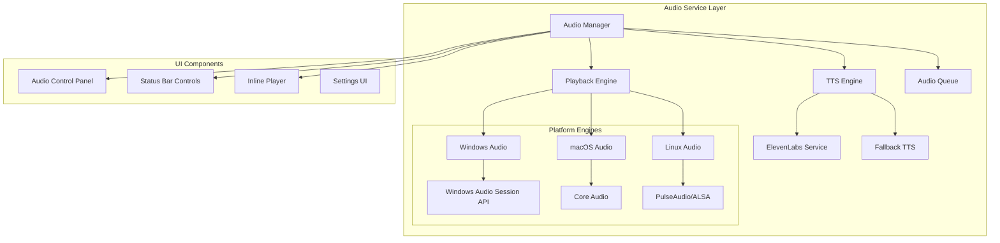

# CoachNTT VSCode Extension Audio Features

## Overview

This document outlines the audio feature set for the CoachNTT VSCode extension, incorporating ElevenLabs text-to-speech (TTS) synthesis and native OS audio playback capabilities across Windows, macOS, and Linux platforms.

## Audio Architecture

### Core Components



## Text-to-Speech Integration

### ElevenLabs Service

```typescript
export interface ElevenLabsConfig {
  apiKey: string;
  voiceId?: string;
  modelId?: string;
  stability?: number;
  similarityBoost?: number;
  style?: number;
  useSpeakerBoost?: boolean;
}

export class ElevenLabsService {
  constructor(private config: ElevenLabsConfig) {}
  
  async synthesize(text: string, options?: TTSOptions): Promise<AudioBuffer> {
    const response = await fetch('https://api.elevenlabs.io/v1/text-to-speech/' + this.config.voiceId, {
      method: 'POST',
      headers: {
        'Accept': 'audio/mpeg',
        'Content-Type': 'application/json',
        'xi-api-key': this.config.apiKey
      },
      body: JSON.stringify({
        text,
        model_id: options?.modelId || this.config.modelId || 'eleven_monolingual_v1',
        voice_settings: {
          stability: options?.stability || this.config.stability || 0.5,
          similarity_boost: options?.similarityBoost || this.config.similarityBoost || 0.5,
          style: options?.style || this.config.style || 0,
          use_speaker_boost: options?.useSpeakerBoost || this.config.useSpeakerBoost || true
        }
      })
    });
    
    if (!response.ok) {
      throw new Error(`ElevenLabs API error: ${response.statusText}`);
    }
    
    const audioData = await response.arrayBuffer();
    return this.decodeAudioData(audioData);
  }
  
  async getVoices(): Promise<Voice[]> {
    const response = await fetch('https://api.elevenlabs.io/v1/voices', {
      headers: {
        'xi-api-key': this.config.apiKey
      }
    });
    
    const data = await response.json();
    return data.voices.map((v: any) => ({
      id: v.voice_id,
      name: v.name,
      labels: v.labels,
      preview_url: v.preview_url,
      category: v.category
    }));
  }
}
```

### Fallback TTS Options

```typescript
export class FallbackTTSService {
  async synthesize(text: string, options?: TTSOptions): Promise<AudioBuffer> {
    // Use browser's Web Speech API as fallback
    return new Promise((resolve, reject) => {
      const utterance = new SpeechSynthesisUtterance(text);
      utterance.rate = options?.rate || 1.0;
      utterance.pitch = options?.pitch || 1.0;
      utterance.volume = options?.volume || 1.0;
      
      // Record audio data
      const audioContext = new AudioContext();
      const destination = audioContext.createMediaStreamDestination();
      
      utterance.onend = () => {
        // Convert recorded stream to AudioBuffer
        resolve(this.streamToAudioBuffer(destination.stream));
      };
      
      utterance.onerror = reject;
      speechSynthesis.speak(utterance);
    });
  }
}
```

## Native Audio Playback

### Platform-Specific Implementation

#### Windows Audio Engine

```typescript
export class WindowsAudioEngine implements AudioEngine {
  private wasapi: any; // Windows Audio Session API
  
  async initialize(): Promise<void> {
    // Initialize WASAPI through Node.js native module
    this.wasapi = require('@coachntt/windows-audio');
    await this.wasapi.initialize();
  }
  
  async play(buffer: AudioBuffer, options?: PlaybackOptions): Promise<void> {
    const session = await this.wasapi.createAudioSession({
      sampleRate: buffer.sampleRate,
      channels: buffer.numberOfChannels,
      bitDepth: 16
    });
    
    session.on('stateChanged', (state) => {
      this.emit('playbackStateChanged', state);
    });
    
    await session.play(buffer.getChannelData(0), {
      volume: options?.volume || 1.0,
      loop: options?.loop || false
    });
  }
  
  async getDevices(): Promise<AudioDevice[]> {
    return this.wasapi.enumerateDevices();
  }
  
  async setDevice(deviceId: string): Promise<void> {
    await this.wasapi.setDefaultDevice(deviceId);
  }
}
```

#### macOS Audio Engine

```typescript
export class MacOSAudioEngine implements AudioEngine {
  private coreAudio: any;
  
  async initialize(): Promise<void> {
    // Initialize Core Audio through Node.js native module
    this.coreAudio = require('@coachntt/macos-audio');
    await this.coreAudio.initialize();
  }
  
  async play(buffer: AudioBuffer, options?: PlaybackOptions): Promise<void> {
    const player = this.coreAudio.createPlayer({
      sampleRate: buffer.sampleRate,
      channels: buffer.numberOfChannels
    });
    
    // Set up audio unit
    player.on('positionChanged', (position) => {
      this.emit('positionChanged', position);
    });
    
    await player.play(buffer, {
      volume: options?.volume || 1.0,
      rate: options?.rate || 1.0
    });
  }
  
  async getDevices(): Promise<AudioDevice[]> {
    return this.coreAudio.getAudioDevices();
  }
}
```

#### Linux Audio Engine

```typescript
export class LinuxAudioEngine implements AudioEngine {
  private pulseAudio: any;
  private alsa: any;
  
  async initialize(): Promise<void> {
    // Try PulseAudio first, fall back to ALSA
    try {
      this.pulseAudio = require('@coachntt/pulse-audio');
      await this.pulseAudio.connect();
    } catch {
      this.alsa = require('@coachntt/alsa-audio');
      await this.alsa.initialize();
    }
  }
  
  async play(buffer: AudioBuffer, options?: PlaybackOptions): Promise<void> {
    if (this.pulseAudio) {
      const stream = await this.pulseAudio.createPlaybackStream({
        format: 'float32le',
        channels: buffer.numberOfChannels,
        rate: buffer.sampleRate
      });
      
      stream.on('drain', () => this.emit('playbackComplete'));
      await stream.write(buffer);
    } else {
      // ALSA fallback
      const pcm = this.alsa.createPCM('default', 'playback');
      await pcm.prepare({
        format: this.alsa.FORMAT.FLOAT_LE,
        channels: buffer.numberOfChannels,
        rate: buffer.sampleRate
      });
      
      await pcm.write(buffer);
    }
  }
}
```

### Audio Manager

```typescript
export class AudioManager {
  private ttsEngine: TTSEngine;
  private playbackEngine: AudioEngine;
  private queue: AudioQueueItem[] = [];
  private currentlyPlaying: AudioQueueItem | null = null;
  
  constructor() {
    this.initializeEngines();
  }
  
  private async initializeEngines(): Promise<void> {
    // Initialize TTS
    if (this.hasElevenLabsKey()) {
      this.ttsEngine = new ElevenLabsService(this.getElevenLabsConfig());
    } else {
      this.ttsEngine = new FallbackTTSService();
    }
    
    // Initialize platform-specific playback
    switch (process.platform) {
      case 'win32':
        this.playbackEngine = new WindowsAudioEngine();
        break;
      case 'darwin':
        this.playbackEngine = new MacOSAudioEngine();
        break;
      case 'linux':
        this.playbackEngine = new LinuxAudioEngine();
        break;
      default:
        throw new Error(`Unsupported platform: ${process.platform}`);
    }
    
    await this.playbackEngine.initialize();
  }
  
  async speakMemory(memory: Memory, options?: SpeakOptions): Promise<void> {
    const audioBuffer = await this.ttsEngine.synthesize(memory.content, {
      voice: options?.voice,
      speed: options?.speed
    });
    
    const queueItem: AudioQueueItem = {
      id: uuidv4(),
      buffer: audioBuffer,
      metadata: {
        type: 'memory',
        memoryId: memory.id,
        text: memory.content
      },
      priority: options?.priority || 'normal'
    };
    
    if (options?.immediate) {
      await this.playImmediate(queueItem);
    } else {
      this.enqueue(queueItem);
    }
  }
  
  async speakCodeExplanation(code: string, explanation: string): Promise<void> {
    const combined = `Here's the code: ${explanation}`;
    const audioBuffer = await this.ttsEngine.synthesize(combined);
    
    await this.playImmediate({
      id: uuidv4(),
      buffer: audioBuffer,
      metadata: {
        type: 'code_explanation',
        code,
        explanation
      }
    });
  }
}
```

## UI Components

### Audio Control Panel

```typescript
export class AudioControlPanel implements vscode.WebviewViewProvider {
  private _view?: vscode.WebviewView;
  
  resolveWebviewView(webviewView: vscode.WebviewView): void {
    this._view = webviewView;
    webviewView.webview.options = {
      enableScripts: true
    };
    
    webviewView.webview.html = this.getHtmlContent();
    this.setupMessageHandlers();
  }
  
  private getHtmlContent(): string {
    return `
      <!DOCTYPE html>
      <html>
      <head>
        <style>
          .audio-player {
            padding: 16px;
            display: flex;
            flex-direction: column;
            gap: 12px;
          }
          
          .controls {
            display: flex;
            justify-content: center;
            gap: 8px;
          }
          
          .control-btn {
            width: 36px;
            height: 36px;
            border-radius: 50%;
            border: none;
            background: var(--vscode-button-background);
            color: var(--vscode-button-foreground);
            cursor: pointer;
            display: flex;
            align-items: center;
            justify-content: center;
          }
          
          .progress-bar {
            width: 100%;
            height: 4px;
            background: var(--vscode-input-background);
            border-radius: 2px;
            position: relative;
          }
          
          .progress-fill {
            height: 100%;
            background: var(--vscode-progressBar-background);
            border-radius: 2px;
            transition: width 0.1s;
          }
          
          .volume-control {
            display: flex;
            align-items: center;
            gap: 8px;
          }
          
          .volume-slider {
            flex: 1;
          }
          
          .voice-selector {
            width: 100%;
            padding: 6px;
            background: var(--vscode-input-background);
            color: var(--vscode-input-foreground);
            border: 1px solid var(--vscode-input-border);
            border-radius: 4px;
          }
          
          .queue-list {
            max-height: 200px;
            overflow-y: auto;
            border: 1px solid var(--vscode-panel-border);
            border-radius: 4px;
          }
          
          .queue-item {
            padding: 8px;
            border-bottom: 1px solid var(--vscode-panel-border);
            display: flex;
            justify-content: space-between;
            align-items: center;
          }
          
          .queue-item.playing {
            background: var(--vscode-list-activeSelectionBackground);
            color: var(--vscode-list-activeSelectionForeground);
          }
        </style>
      </head>
      <body>
        <div class="audio-player">
          <!-- Playback Controls -->
          <div class="controls">
            <button class="control-btn" id="play-pause">
              <i class="codicon codicon-play"></i>
            </button>
            <button class="control-btn" id="stop">
              <i class="codicon codicon-stop"></i>
            </button>
            <button class="control-btn" id="skip">
              <i class="codicon codicon-arrow-right"></i>
            </button>
          </div>
          
          <!-- Progress Bar -->
          <div class="progress-bar">
            <div class="progress-fill" id="progress" style="width: 0%"></div>
          </div>
          
          <!-- Time Display -->
          <div class="time-display">
            <span id="current-time">0:00</span> / <span id="total-time">0:00</span>
          </div>
          
          <!-- Volume Control -->
          <div class="volume-control">
            <i class="codicon codicon-unmute"></i>
            <input type="range" class="volume-slider" id="volume" min="0" max="100" value="100">
            <span id="volume-value">100%</span>
          </div>
          
          <!-- Voice Selection -->
          <select class="voice-selector" id="voice-select">
            <option value="">Default Voice</option>
          </select>
          
          <!-- Speed Control -->
          <div class="speed-control">
            <label>Speed: <span id="speed-value">1.0x</span></label>
            <input type="range" id="speed" min="0.5" max="2" step="0.1" value="1">
          </div>
          
          <!-- Queue -->
          <div class="queue-section">
            <h4>Queue (<span id="queue-count">0</span>)</h4>
            <div class="queue-list" id="queue-list"></div>
          </div>
        </div>
        
        <script>
          const vscode = acquireVsCodeApi();
          
          // Handle control buttons
          document.getElementById('play-pause').addEventListener('click', () => {
            vscode.postMessage({ command: 'togglePlayback' });
          });
          
          document.getElementById('stop').addEventListener('click', () => {
            vscode.postMessage({ command: 'stop' });
          });
          
          document.getElementById('skip').addEventListener('click', () => {
            vscode.postMessage({ command: 'skip' });
          });
          
          // Handle volume
          document.getElementById('volume').addEventListener('input', (e) => {
            const value = e.target.value;
            document.getElementById('volume-value').textContent = value + '%';
            vscode.postMessage({ command: 'setVolume', value: value / 100 });
          });
          
          // Handle speed
          document.getElementById('speed').addEventListener('input', (e) => {
            const value = e.target.value;
            document.getElementById('speed-value').textContent = value + 'x';
            vscode.postMessage({ command: 'setSpeed', value: parseFloat(value) });
          });
          
          // Handle voice selection
          document.getElementById('voice-select').addEventListener('change', (e) => {
            vscode.postMessage({ command: 'setVoice', voiceId: e.target.value });
          });
          
          // Handle messages from extension
          window.addEventListener('message', event => {
            const message = event.data;
            switch (message.type) {
              case 'updateState':
                updatePlayerState(message.state);
                break;
              case 'updateQueue':
                updateQueue(message.queue);
                break;
              case 'updateVoices':
                updateVoiceList(message.voices);
                break;
            }
          });
          
          function updatePlayerState(state) {
            // Update play/pause button
            const playBtn = document.getElementById('play-pause');
            playBtn.innerHTML = state.isPlaying 
              ? '<i class="codicon codicon-pause"></i>' 
              : '<i class="codicon codicon-play"></i>';
            
            // Update progress
            if (state.duration > 0) {
              const progress = (state.position / state.duration) * 100;
              document.getElementById('progress').style.width = progress + '%';
              document.getElementById('current-time').textContent = formatTime(state.position);
              document.getElementById('total-time').textContent = formatTime(state.duration);
            }
          }
          
          function updateQueue(queue) {
            document.getElementById('queue-count').textContent = queue.length;
            const queueList = document.getElementById('queue-list');
            queueList.innerHTML = queue.map((item, index) => `
              <div class="queue-item ${item.isPlaying ? 'playing' : ''}">
                <span>${item.title || 'Audio ' + (index + 1)}</span>
                <button class="control-btn small" onclick="removeFromQueue('${item.id}')">
                  <i class="codicon codicon-close"></i>
                </button>
              </div>
            `).join('');
          }
          
          function updateVoiceList(voices) {
            const select = document.getElementById('voice-select');
            select.innerHTML = '<option value="">Default Voice</option>' + 
              voices.map(v => `<option value="${v.id}">${v.name}</option>`).join('');
          }
          
          function formatTime(seconds) {
            const mins = Math.floor(seconds / 60);
            const secs = Math.floor(seconds % 60);
            return mins + ':' + secs.toString().padStart(2, '0');
          }
          
          function removeFromQueue(id) {
            vscode.postMessage({ command: 'removeFromQueue', id });
          }
        </script>
      </body>
      </html>
    `;
  }
}
```

### Status Bar Controls

```typescript
export class AudioStatusBarProvider {
  private statusBarItem: vscode.StatusBarItem;
  private miniControls: vscode.StatusBarItem;
  
  constructor() {
    // Main status
    this.statusBarItem = vscode.window.createStatusBarItem(
      vscode.StatusBarAlignment.Right,
      100
    );
    this.statusBarItem.command = 'coachntt.audio.togglePanel';
    
    // Mini controls
    this.miniControls = vscode.window.createStatusBarItem(
      vscode.StatusBarAlignment.Right,
      99
    );
  }
  
  updateStatus(state: AudioState): void {
    if (state.isPlaying) {
      this.statusBarItem.text = `$(sync~spin) ${state.title || 'Playing...'}`;
      this.statusBarItem.tooltip = 'Click to open audio controls';
      this.miniControls.text = '$(debug-pause)';
      this.miniControls.command = 'coachntt.audio.pause';
    } else if (state.queue.length > 0) {
      this.statusBarItem.text = `$(play) ${state.queue.length} in queue`;
      this.miniControls.text = '$(play)';
      this.miniControls.command = 'coachntt.audio.play';
    } else {
      this.statusBarItem.text = '$(unmute) Audio ready';
      this.miniControls.hide();
    }
    
    this.statusBarItem.show();
  }
}
```

### Inline Audio Player

```typescript
export class InlineAudioPlayer {
  static async showForMemory(memory: Memory): Promise<void> {
    const panel = vscode.window.createWebviewPanel(
      'audioPlayer',
      'Audio: ' + memory.content.substring(0, 30) + '...',
      vscode.ViewColumn.Beside,
      {
        enableScripts: true,
        retainContextWhenHidden: true
      }
    );
    
    panel.webview.html = `
      <!DOCTYPE html>
      <html>
      <head>
        <style>
          body {
            padding: 20px;
            font-family: var(--vscode-font-family);
          }
          .content {
            margin-bottom: 20px;
            padding: 15px;
            background: var(--vscode-textBlockQuote-background);
            border-left: 3px solid var(--vscode-textBlockQuote-border);
          }
          .controls {
            display: flex;
            gap: 10px;
            align-items: center;
          }
          .play-btn {
            padding: 8px 16px;
            background: var(--vscode-button-background);
            color: var(--vscode-button-foreground);
            border: none;
            border-radius: 4px;
            cursor: pointer;
          }
        </style>
      </head>
      <body>
        <div class="content">
          <h3>Memory Content</h3>
          <p>${memory.content}</p>
          <small>Created: ${new Date(memory.timestamp).toLocaleString()}</small>
        </div>
        
        <div class="controls">
          <button class="play-btn" onclick="speak()">
            <i class="codicon codicon-play"></i> Speak
          </button>
          <select id="voice">
            <option>Default Voice</option>
          </select>
          <label>
            Speed: 
            <input type="range" id="speed" min="0.5" max="2" step="0.1" value="1">
            <span id="speed-value">1.0x</span>
          </label>
        </div>
        
        <script>
          const vscode = acquireVsCodeApi();
          
          function speak() {
            vscode.postMessage({
              command: 'speak',
              memoryId: '${memory.id}',
              voice: document.getElementById('voice').value,
              speed: parseFloat(document.getElementById('speed').value)
            });
          }
          
          document.getElementById('speed').addEventListener('input', (e) => {
            document.getElementById('speed-value').textContent = e.target.value + 'x';
          });
        </script>
      </body>
      </html>
    `;
  }
}
```

## Settings Configuration

```typescript
export interface AudioSettings {
  // ElevenLabs
  'coachntt.audio.elevenlabs.enabled': boolean;
  'coachntt.audio.elevenlabs.apiKey': string;
  'coachntt.audio.elevenlabs.defaultVoice': string;
  'coachntt.audio.elevenlabs.stability': number;
  'coachntt.audio.elevenlabs.similarity': number;
  
  // Playback
  'coachntt.audio.playback.volume': number;
  'coachntt.audio.playback.speed': number;
  'coachntt.audio.playback.device': string;
  'coachntt.audio.playback.autoPlay': boolean;
  
  // UI
  'coachntt.audio.ui.showStatusBar': boolean;
  'coachntt.audio.ui.showInlineControls': boolean;
  'coachntt.audio.ui.queueBehavior': 'append' | 'replace';
  
  // Features
  'coachntt.audio.features.speakOnRecall': boolean;
  'coachntt.audio.features.speakCodeComments': boolean;
  'coachntt.audio.features.announceErrors': boolean;
}
```

## Commands

```typescript
export function registerAudioCommands(context: vscode.ExtensionContext): void {
  // Basic controls
  context.subscriptions.push(
    vscode.commands.registerCommand('coachntt.audio.play', () => audioManager.play()),
    vscode.commands.registerCommand('coachntt.audio.pause', () => audioManager.pause()),
    vscode.commands.registerCommand('coachntt.audio.stop', () => audioManager.stop()),
    vscode.commands.registerCommand('coachntt.audio.skip', () => audioManager.skip()),
    
    // TTS commands
    vscode.commands.registerCommand('coachntt.audio.speakSelection', async () => {
      const editor = vscode.window.activeTextEditor;
      if (editor) {
        const selection = editor.document.getText(editor.selection);
        await audioManager.speak(selection);
      }
    }),
    
    vscode.commands.registerCommand('coachntt.audio.speakMemory', async (memory: Memory) => {
      await audioManager.speakMemory(memory);
    }),
    
    vscode.commands.registerCommand('coachntt.audio.speakFile', async () => {
      const editor = vscode.window.activeTextEditor;
      if (editor) {
        const content = editor.document.getText();
        await audioManager.speak(content, { 
          title: path.basename(editor.document.fileName) 
        });
      }
    }),
    
    // UI commands
    vscode.commands.registerCommand('coachntt.audio.togglePanel', () => {
      AudioControlPanel.toggle();
    }),
    
    vscode.commands.registerCommand('coachntt.audio.showQueue', () => {
      AudioQueueView.show();
    })
  );
}
```

## Integration Points

### Memory Recall Integration

```typescript
// Automatically speak recalled memories when enabled
memoryService.on('memoriesRecalled', async (memories: Memory[]) => {
  if (settings.get('coachntt.audio.features.speakOnRecall')) {
    const topMemory = memories[0];
    if (topMemory) {
      await audioManager.speakMemory(topMemory, {
        priority: 'high',
        announcement: 'Found relevant memory'
      });
    }
  }
});
```

### Code Intelligence Integration

```typescript
// Speak code explanations
codeIntelligenceService.on('patternDetected', async (pattern: CodePattern) => {
  if (pattern.severity === 'error' && settings.get('coachntt.audio.features.announceErrors')) {
    await audioManager.speak(`Code issue detected: ${pattern.message}`, {
      priority: 'high',
      voice: 'alert'
    });
  }
});
```

### Conversation Integration

```typescript
// Read conversation responses
conversationService.on('responseReceived', async (response: ConversationResponse) => {
  if (response.shouldSpeak) {
    await audioManager.speak(response.content, {
      voice: response.voiceId || 'assistant',
      queue: true
    });
  }
});
```

## Accessibility Features

- **Screen Reader Compatibility**: All audio controls properly labeled
- **Keyboard Navigation**: Full keyboard support for all controls
- **Audio Descriptions**: Optional descriptions before content
- **Transcripts**: Automatic transcript generation for all spoken content
- **Visual Indicators**: Visual feedback for audio state changes

## Performance Considerations

- **Audio Buffering**: Pre-load next item in queue
- **Streaming TTS**: Stream audio as it's generated
- **Resource Management**: Release audio resources when not in use
- **Background Processing**: TTS synthesis in worker threads

## Error Handling

```typescript
audioManager.on('error', (error: AudioError) => {
  if (error.type === 'tts_failure') {
    // Fall back to system TTS
    vscode.window.showWarningMessage(
      'ElevenLabs TTS failed, using system voice',
      'Configure API Key'
    ).then(selection => {
      if (selection === 'Configure API Key') {
        vscode.commands.executeCommand('workbench.action.openSettings', 
          'coachntt.audio.elevenlabs.apiKey'
        );
      }
    });
  }
});
```

## Security Considerations

- **API Key Storage**: Secure storage using VS Code Secret Storage API
- **Content Filtering**: Sanitize text before sending to TTS
- **Rate Limiting**: Implement client-side rate limiting for API calls
- **Data Privacy**: No audio content stored without user consent

## Future Enhancements

1. **Voice Cloning**: Support for custom voice models
2. **Multi-language**: Auto-detect and switch languages
3. **Emotion Control**: Adjust voice emotion based on content
4. **Background Music**: Optional ambient music during coding
5. **Voice Commands**: Control extension with voice
6. **Audio Effects**: Apply effects like echo, reverb
7. **Podcast Export**: Export session as podcast episode
8. **Live Streaming**: Stream audio to team members